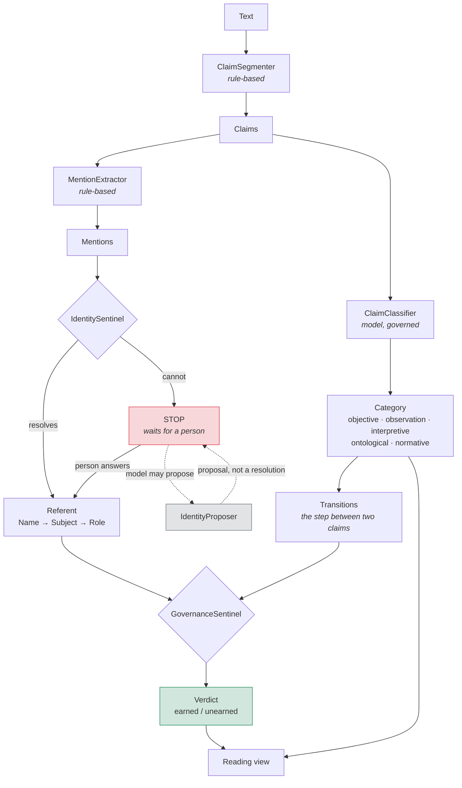
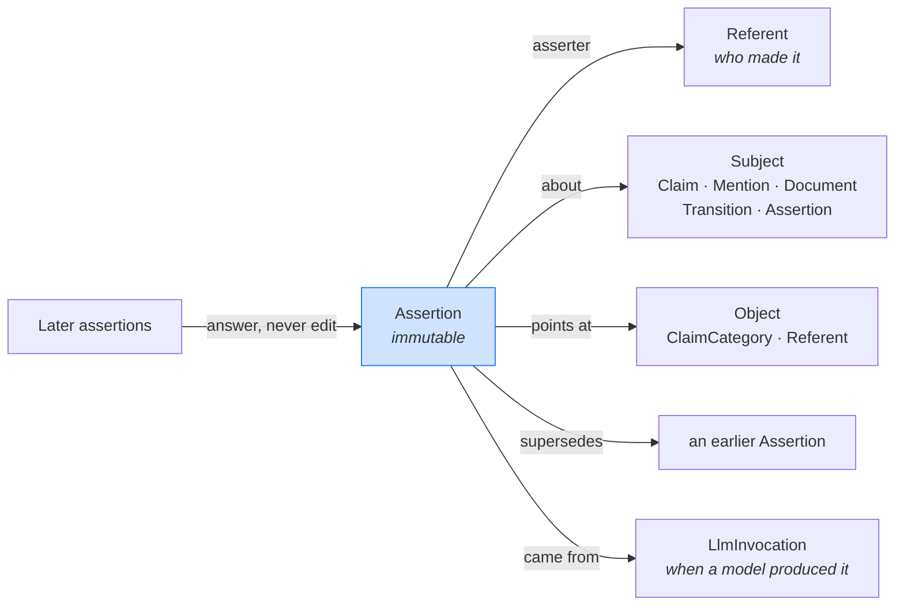
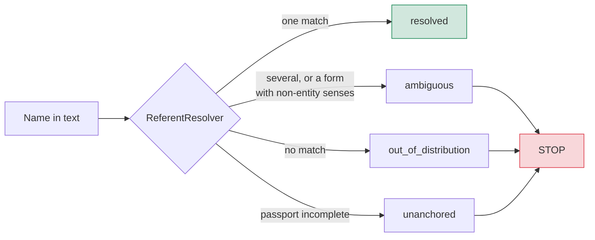
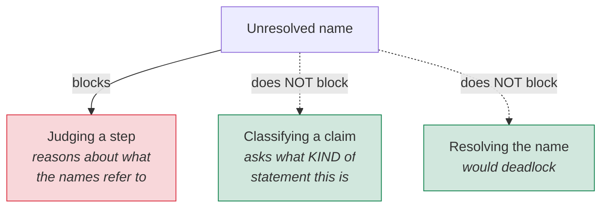
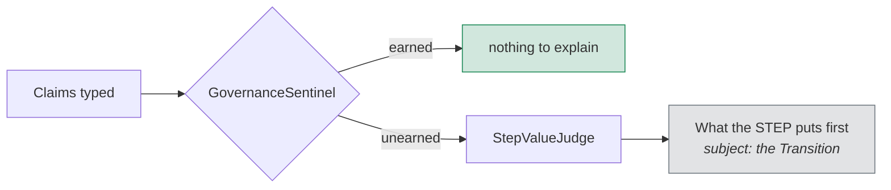
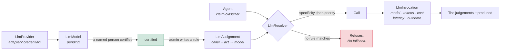
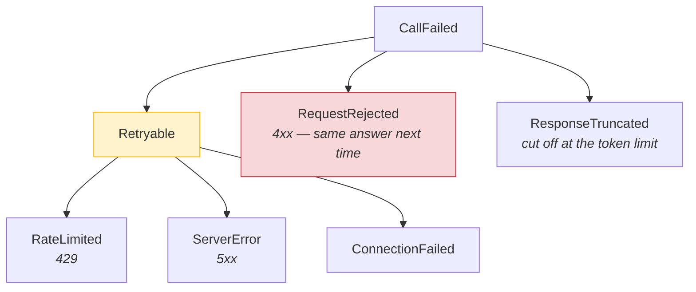
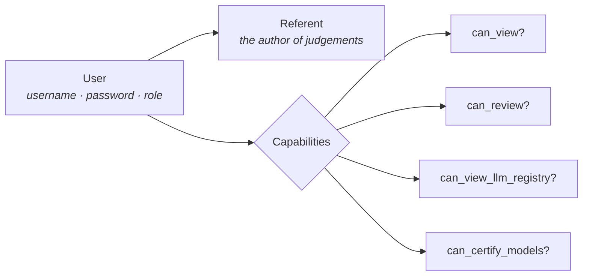
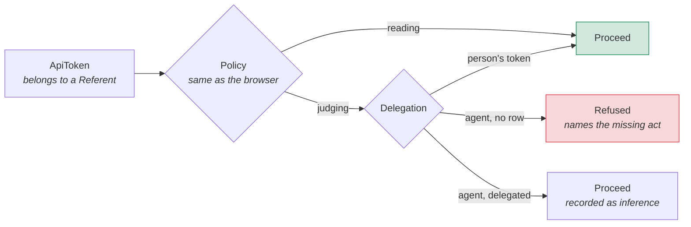
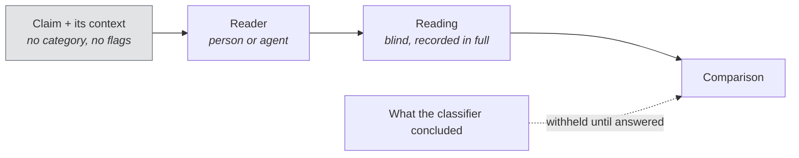

# Architecture

How the system is put together, and why the seams fall where they do.

[`THESIS.md`](THESIS.md) argues the position; [`CONOPS.md`](CONOPS.md) says what
the system is for; [`LEXICON.md`](LEXICON.md) defines the vocabulary; this
document says how it is built.

This is a description of the design, not of how it came to be. Where a decision
had live alternatives, the alternatives and the reasoning are in
[`decisions/`](decisions/); where a claim about the system rests on a
measurement, the measurement is in [`BASELINE.md`](BASELINE.md),
[v2](BASELINE-v2.md) or [v3](BASELINE-v3.md). Figures quoted here are quoted
from there.

---

## The shape of it

Text arrives, is cut into claims, and every capitalised string in it is
proposed as a name. Nothing is predicated of a name until someone has said what
it refers to. Claims are typed by kind; the steps *between* claims are judged
for whether the promotion from one kind to the next was earned.



Two seams to notice at the outset. The **rule-based** stages are deliberately not
model-backed — segmentation and extraction decide what counts as a claim and what
counts as a name, and every later judgement inherits those decisions
([ADR 9](decisions/0009-ingest-is-deterministic.md)). And the identity STOP
blocks the path to *governance* but not to *classification*
([ADR 11](decisions/0011-the-lock-guards-predication.md)).

### Structure is not a claim

A heading, a table row, a rule — part of the document, but not an assertion about
anything. These are marked rather than dropped, so the text stays in the record
and still renders; what changes is that nothing asks them what kind of claim they
are, and no step is drawn through them, because a heading is where an argument
restarts rather than a move within one.

Where the text is markdown this is decided with certainty: a row is a table row
because a delimiter row says the block is a table. Where it is plain prose a
deliberately timid heuristic applies — an *isolated* short unterminated line,
never a run of them. The timidity is the point: a confident rule swallows the
framework's own category definitions when a table has been flattened into bare
newlines before it arrives, and a claim wrongly called structure is invisible to
everything downstream.

*Alone on its line* means alone on its line. Trailing whitespace does not
disqualify a line from being structure, and the predicate is written to ignore
it, because a rule that silently stops applying is worse than one that does not
exist.

A **lead-in** is structure too — a short line ending in a colon, alone on its
line ([ADR 16](decisions/0016-a-colon-line-is-a-lead-in.md)). `Postscript:`
asserts nothing and the claim is the text underneath. The rule has a cost the ADR
states rather than argues away: `Polanyi reverses it:` does assert something and
is hidden anyway, because telling the two apart means deciding whether a line
*predicates*, and that is interpreting the text.

---

## The concepts, and where each lives

The whole conceptual surface, so a reader can tell what exists from what is
merely implied. [`LEXICON.md`](LEXICON.md) defines these terms; this says where
each one is realised.

| Concept | Realised as | Section |
|---|---|---|
| Assertion | the single record type; immutable, attributed | [Foundations](#i-foundations) |
| Derivation | no `status`, `verdict` or `category` column exists | [Foundations](#i-foundations) |
| Referent · Cognitive Passport | `Name → Subject → Role` | [Order of operations](#ii-order-of-operations) |
| Mention · Entity Noise · STOP | the input boundary | [Order of operations](#ii-order-of-operations) |
| Alias | one entity, several spellings | [Order of operations](#ii-order-of-operations) |
| Polarity · polarity invariance | surface reading, and where it cannot be trusted | [Order of operations](#ii-order-of-operations) |
| Claim · Category · Agreement | what kind of statement, on how many readings | [Judgement](#iii-judgement) |
| Transition · Promotion · Verdict | what a move costs, and whether it was earned | [Judgement](#iii-judgement) |
| Framework · Premise | categories, weights, values, stages — all data | [Judgement](#iii-judgement), [Disagreement](#iv-disagreement) |
| Value · step value reading | the third level, and its measured failure | [Judgement](#iii-judgement) |
| Contested · Drift · Position | three states, never merged | [Disagreement](#iv-disagreement) |
| Disposition | a judgement about a judgement, recorded beside it | [Disagreement](#iv-disagreement) |
| Provider · Model · Assignment · Invocation | the fenced model layer | [Governing the machine](#v-governing-the-machine) |
| User · Capability · Policy | authorisation | [Governing the machine](#v-governing-the-machine) |
| ApiToken · Delegation · TEI inversion | an agent acting as itself | [Governing the machine](#v-governing-the-machine) |
| Temporal drift | an actor against its own past | [Governing the machine](#v-governing-the-machine) |
| Baseline · Measurement | a claim about the system, in the system | [Measurement](#vi-measurement) |
| Blind reading | the one figure that is not self-agreement | [Measurement](#vi-measurement) |
| Review · worksheet | correction, and a control with a person in it | [Measurement](#vi-measurement) |
| Probe · Order stability · Ranking | values observed under constructed conflict | [Measurement](#vi-measurement) |
| Profile · Reading view | what is handed to a person | [Surfaces](#vii-surfaces) |

---

# I. Foundations

## One record type

A sentinel's flag, a reviewer's dismissal, a verdict on a step, a
classification, an identity resolution — all the same object. Immutable,
attributed, evidenced, supersedable, challengeable
([ADR 8](decisions/0008-one-epistemic-record-type.md)).



An assertion may be *about* another assertion — that is what makes the structure
recursive, and it is how a flag is answered without the flag being altered.

An assertion is an **event**, not a property. It records that a claim *was
made* — never that the claim was correct. An assertion may be perfectly
authentic and entirely mistaken, and the architecture holds both facts at once.

Nothing is edited. `readonly? = persisted?` is enforced at the model, so an
error is never erased; it is *answered* by a later assertion that references it.
This is also why the record is never tidied retroactively. A resolution recorded
under the wrong author stays as recorded and the report says the attribution is
missing, because rewriting history to make the record look better is the one
thing immutability exists to forbid.

## Nothing is stored that can be derived

`claims`, `mentions` and `relationships` carry no `status`, `verdict` or
`category` column at all. Each of these is read from the standing assertions.

| Question | Answered by |
|---|---|
| What category is this claim? | the strict majority of its standing `classify` assertions |
| Is this mention resolved? | whether a standing `resolve` assertion names it |
| Was this step earned? | the standing positions on the transition, under one framework |
| Is this flag still open? | whether a standing `accept`/`reject` answers it |
| Is the document locked? | whether any STOP flag stands undisposed |

A stored copy could disagree with the record it summarises. Derivation costs
queries and buys the guarantee that it cannot. The same rule governs the
generated documents: [`BASELINE.md`](BASELINE.md) and [`LEXICON.md`](LEXICON.md)
are rendered from the record for the same reason `Claim#category` is derived from
it.

The registry is the deliberate exception: `llm_providers.status`,
`llm_models.certification_status` and `llm_invocations.status` are ordinary
columns. They record configuration and what happened on the wire, not judgements
about a text, so there is nothing for them to drift out of step with.

---

# II. Order of operations

Some questions cannot be asked until others are answered. The ordering is
enforced, not documented.

## Identity precedes reasoning about an entity

A name arriving without established reference is *Entity Noise*. The Cognitive
Passport is `Name → Subject → Role`, and a partial passport is not a weaker
anchor — it is no anchor.



The resolver is deterministic on purpose: its job is to refuse to guess, and a
probabilistic resolver would reintroduce the guess it exists to prevent.

Matching is on whole names. A resolver matching substrings finds `Eve` inside
`even` and raises a STOP for every occurrence, and because a STOP blocks
governance, a document can be locked by a name that does not appear in it.

### What a STOP blocks

The seam most likely to be misread, so it is drawn explicitly.



*"Polanyi said we can know more than we can tell"* is an objective claim
whichever Polanyi it is. The lock guards **predication**, not description: gating
classification on resolution makes ordinary prose unreadable, one essay producing
204 blocking questions and no types at all
([ADR 11](decisions/0011-the-lock-guards-predication.md)).

Agency is preserved throughout. A person may dispose of a STOP and proceed. What
they may not do is reason past it silently.

### One entity, several names

`Polanyi`, `Polayani` and `Michael Polanyi` are one philosopher. Grounding them
separately would break object constancy over a transposed letter, so a name can
be declared **another spelling** of an existing referent. The alias is recorded;
the document's text is never corrected, because the misspelling is evidence that
it was there.

## Action polarity, and where it cannot be read

The G3/G7 Matrix reads verbs as forces applied between nodes rather than as
grammatical decoration. The difficulty is Freud's: a surface negation can carry
the very intent it appears to deny. *"Nechceš kávu?"* — *"Don't you want
coffee?"* — is an offer in Slovak and is read as refusal through an
English-shaped frame.

So `ClaimPolarity` reads **surface** polarity only, deterministically, and says
so. Its useful output is not the reading but the constructions where the reading
cannot be trusted — a negative question, a double negative, a negated modal.
`SituationalSentinel` raises a **concern** on those, never a STOP: an unreadable
direction does not make a document ungroundable the way an unresolved name does,
because nothing is yet predicating a direction of anything.

Litotes is a recorded miss, pinned by a spec rather than papered over. *"It is
not uncommon"* reads as denied and means roughly the opposite, and no structural
rule separates `uncommon` from `understood`, `universe` or `information`.
Detecting it needs a lexicon of negative-prefixed words — world knowledge, which
is what this layer exists not to guess at.

The enforceable claim is narrow, in the manner of gap invariance:

> **Polarity invariance.** Negating a claim does not change what KIND of claim
> it is. *"The wall represented fear"* is interpretive; so is *"The wall did not
> represent fear."*

A classifier whose category moves under negation is reading what a claim says
rather than what it does. `PolarityInvariance` checks it by construction — two
classifications, no opinion — and abstains where a negation cannot be built
structurally, because a paraphrase would put the checker's own rewrite underneath
the result.

---

# III. Judgement

Three levels, and each is a different question about the same text: **trust** —
can I lean on this claim; **judgement** — did it survive contact with
consequence; and beneath both, **values**, the commitments that decide which
arguments feel reasonable before evidence arrives.

## Claims: one reading is a sample

A single machine reading is not a finding. Re-running a whole document changes
about half the steps it flags — Jaccard 0.51 between two passes under identical
conditions — so the difference has to be visible rather than assumed.

Asking three times and taking a majority helps, and less than one would hope:
0.51 to 0.60 for three times the cost. Two further measurements separate what
that figure mixes. **0.70** is how often two passes flag the same step *when both
can judge it*; the rest is coverage — one pass abstaining on an endpoint the
other typed. Coverage is itself unstable, the same classifier leaving 30 claims
unread on one pass and 51 on the next.

A claim's category is therefore what a **strict majority** of its readings say. A
plurality does not decide: two of five is not agreement. Where the readings reach
no majority the claim is left unclassified, which is what abstention already
means here, and is better than reporting whichever reading happened to be last.

A person's judgement is not a vote among the machine's — it settles the question.
An **abstention is not a judgement**: a person saying *"I cannot tell"* is
recorded as a reading and leaves whatever the machine agreed on standing, rather
than blanking a category three readings had settled.

Readings taken **blind**, for comparison rather than as part of the
classification pass, are recorded in full and counted in no tally. Merging a
second judge's readings into the first judge's majority would be two instruments
reported as one measurement — the error this framework exists to catch,
committed against itself.

Readings are **additive**. Nothing is overwritten, each reading is its own
assertion, and a document already carrying one reading run again at three buys
two more. A decline counts as an asking, so a claim the classifier keeps refusing
does not cost a call on every pass.

Every finding carries how firmly it stands, **bounded by its least settled
endpoint** — a step between a claim typed 3 of 3 and one typed 2 of 3 is only as
settled as the second. A flag reading `1 of 1` and one reading `3 of 3` are
different objects and are rendered as different objects.

## Steps: what a move costs

The transition, not the claim, is the unit of risk. A claim may be perfectly
sound; the danger is the unannounced promotion between claims.

What a move costs is **framework data**, set per ordered pair rather than by
subtracting ranks, because `interpretive → ontological` and
`objective → interpretive` are not the same move. A lateral move between two
kinds of equal warrant costs nothing, and a retreat to firmer ground costs
nothing. Only a promotion does.

`GovernanceSentinel` is deterministic and calls no model. It refuses in the
places refusal is the correct answer: an unclassified endpoint yields no verdict
at all, and a pair the framework has not priced yields none either — treating an
absent weight as zero would judge every step of an unweighted framework earned,
silently permissive in the one place the system exists to refuse.

It will not govern its own work. A sentinel that classified a claim may not also
rule that the classification earned its promotion, and the guard is structural
rather than procedural.

Severity is `concern`, not `stop`. An unearned promotion may well be one the
author is entitled to, and the Sentinel's job is to make the step visible, not to
prevent it.

## Values: the third level

The Motivation domain has carried a component named **Values** since the
framework was first seeded. `FrameworkValue` is that component instantiated —
seeded like categories and promotions, scoped to a framework, and carrying for
each value both what it protects and what it **subordinates**. A value with
nothing it sets aside is a preference rather than a commitment; the pair is what
makes a reading arguable, since *"put X first over Y"* can be contested and
*"values X"* cannot.

One vocabulary means what a **model** prioritises under conflict and what a
**text's step** puts first are the same currency, where free-text values on each
side would be incomparable by construction.

**Provenance is part of the data.** Eight entries are values a model has been
probed against; the other eight are intuition. A seeded list of what people
protect is a claim about people, and the entries say which they are rather than
blending — the same discipline the terminology register applies to disputed
terms.

### Where the third level runs

`StepValueJudge` sits beneath judgement literally rather than metaphorically. It
runs **only** where a verdict has been reached, and only where that verdict was
*unearned*. An unearned step is a place where somebody moved without warrant;
this asks the one question underneath it and asks it nowhere else.



**It is a claim about the move, never about the person**, and the shape of the
record enforces that rather than the prompt: the assertion's subject is the
`Transition`. The class cannot write a claim whose subject is a Referent, so
*"this author values X"* is not a sentence it can express. Inferring what
somebody values from the points where their reasoning failed is a short walk from
psychologising them, and a promise in a system prompt is not a guard.

### What is known about this layer

It does not distinguish signal from noise, and the figure is measured rather than
suspected. Given claim pairs from **unrelated parts of the same document** — no
argumentative relation at all — it treats them almost exactly as it treats real
steps. Three designs, recorded in [v3](BASELINE-v3.md) §§4–6, 9:

| design | real steps | shuffled pairs | gap |
|---|---|---|---|
| open vocabulary | 92.9% | 60.7% | 3.08 SE |
| closed, 16 values | 71.4% | 67.9% | 0.29 SE |
| conflict required first | 60.7% | 53.6% | 0.54 SE |

**The only version that tells real from random is the one that invents most.** An
open vocabulary is where the 61% invention rate comes from: asked what a move
protects, a judge that may answer anything can always produce something, so it
does. Closing the vocabulary to sixteen broad values stops the invention and
turns out to fit almost any pair of claims.

The diagnosis that fits all three is that **the question has no ground truth in a
found text**, which is not something an architecture can supply. A probe
*constructs* a conflict, so a judge rules on one known to exist; a found step
either has one or does not, and there is no independent way to tell, so asking
whether one exists is itself an ungrounded judgement.

That diagnosis is itself only supported by three models failing, which is why the
[worksheet](#the-value-worksheet) exists: a question a model cannot answer may
still be one a person can.

Meanwhile the layer stays, its output is presented as prompts for a person rather
than findings, and its confidence is not used as a filter because it carries no
information — 0.9 to 1.0 whatever it is shown.

---

# IV. Disagreement

Storage preserves disagreement by construction: nothing is edited, and every
reading is its own assertion. The derived reads preserve it by design, which is a
separate obligation — a read that resolves competing judgements by recency has
not adjudicated anything, it has hidden the competition and reported the survivor
as consensus.

## Three states, never merged

| State | Meaning | Reported as |
|---|---|---|
| **agreement** | every standing position says the same thing | the verdict |
| **contested** | two asserters disagree under the **same** premises | `CONTESTED`, no verdict |
| **drift** | one asserter changed **its own** answer | the latest stands, and the change is reported |

The distinction between the second and third is load-bearing. Two judges
disagreeing is disagreement; one judge answering differently on a second run is a
fact about the instrument rather than about the thing judged, and merging them
would hide whichever one you cared about.

`CONTESTED` sits deliberately outside `VERDICTS`. Nothing can assert it — it is
observed, never recorded, and `record_verdict!("contested")` raises. The same
holds for a contested disposition: it is what two standing disposals amount to,
not a disposal anybody can make.

Every read collapses **one position per asserter**, latest, before comparing.
A judge that ruled three times holds one position, not three, so repetition
cannot outvote a second judge.

| Read | Positions compared |
|---|---|
| `Transition#verdict(framework:)` | one per asserter, within one framework |
| `Claim#agreement` | one per person; the machine's majority when no person has read |
| `Assertion#disposition` | one per reviewer |
| `Mention#resolution` | a person's over a system's |

For claims this means a person's judgement wins over the machine's and is **not**
exempt from another person's. Two readers who name different categories leave the
claim untyped — the strict majority rule the machine is held to, applied on both
sides. Once a person has read, the machine no longer speaks, including when the
people are split; falling back there would type a claim by machine majority while
`agreement` reported no majority at all.

A contested claim cannot be settled through `Review`, which never serves a claim
classification. What settles it is a further **independent** reading — the same
reason the blind surface exists.

## A disposal is recorded beside, never over

A person may accept or reject any judgement. The judgement is untouched and stays
standing; what changes is that somebody has now said something about it, and that
saying is itself attributable and challengeable.

Because nothing is superseded, a rejected reading is still *standing*, and every
query asking for standing assertions still returns it. **Anything that presents
standing assertions to a person therefore has to decide what a disposal means to
it.** Standing and undisputed are different properties, and only one of them is a
scope. `ProfileReport` filters on disposition explicitly: a rejected reading is
not shown, one a person let stand is marked and sorted first, and the section
states how many fall in each state.

## A resolution names who decided it

Identity precedes reasoning, so the answer to *who says this name refers to that*
is load-bearing for every judgement downstream of it.

`IdentitySentinel.verify!(mention, by:)` takes whoever decided. Verification at
ingest passes nothing and is the Sentinel's own inference; grounding passes the
person or agent who answered a STOP, and every occurrence of the name carries
that attribution because they are all consequences of one decision. The
resolution records `grounded` either way, so three states are distinguishable
([ADR 19](decisions/0019-a-resolution-names-its-decider.md)):

| | |
|---|---|
| `grounded: false` | the resolver matched it; nobody was asked |
| `grounded: true` | somebody answered a STOP — a person, or an agent under delegation |
| key absent | recorded before resolutions named their decider |

An agent grounding under delegation is a system making a decision, so
`inferred?` alone cannot carry this distinction and the report separates all
three.

## Premises are data, and a ruling names its own

A ruling carries `framework_id`. `Transition#verdict(framework:)` reads one
framework's answer; `#verdicts` returns all of them
([ADR 18](decisions/0018-a-ruling-names-its-premises.md)).

This is what lets two incompatible moral premises hold at once. `alexicon-2.0`
charges 2 for `ontological → normative`, with a rationale naming Hume;
`lewisian-1.0` charges 0, holding that a claim about what ought to be is a claim
about what is. Both rule on the same steps and both sets of verdicts stand:

```
{"alexicon-2.0" => "unearned", "lewisian-1.0" => "earned"}
```

On document 30 they agree on 90 of 93 steps and differ on 3, all of them
`ontological ↔ normative` — the two pairs whose weights differ, and no others.

`GovernanceSentinel.review!(step, framework:)` translates categories by key, so a
claim classified under one framework is judgeable under another. A framework with
no word for a category has not priced the move and the Sentinel declines rather
than reading the absence as free.

```sh
rake 'alexicon:premise[30,lewisian-1.0]'
```

It judges only what that framework has not already judged. Re-running would
record a second ruling and manufacture drift, which is the confusion the
contested/drift distinction exists to prevent.

**None of this adjudicates.** A difference between premises is a fact about the
premises, not about the text, and the profile says so rather than ranking them.
An architecture must be able to preserve disagreement before it can be asked to
settle any.

---

# V. Governing the machine

## The model is fenced

Which model answers is a governed decision, not a constant. An uncertified model
is unreachable — nobody's judgement runs because a constant named it.



There is deliberately **no fallback** to "the cheapest certified model". A
fallback of that shape means a call silently runs on a model nobody chose for it,
and the invocation record would be the only place that fact appears.

Two conditions are kept apart because they fail differently: a provider needs an
**adapter** (can the code call it?) and a **credential** (may it?). A provider
without an adapter may be registered but never certified — vouching for a model
this application cannot reach would claim a capability that does not exist.

### Adapters, not vendors

Callers speak one interface and one error taxonomy, so nothing upstream knows
which vendor was on the other end.



The decision that depends on this — wait and retry, or stop — is the same
whoever was called.

Provider quirks live in the adapter rather than in each caller's memory of them.
`max_tokens` means the size of the **answer**, for every adapter; a provider that
charges its own thinking against the same budget has that allowance added in its
adapter, so no caller needs to know which providers think.

A retry re-runs the whole document, which is cheap: a claim with a standing
classification is skipped, so it resumes rather than repeating calls already paid
for.

### Where the model is asked, and for what

| Agent | Asks the model | Does not decide |
|---|---|---|
| `claim-classifier` | what kind of claim each statement is | may abstain; below the confidence floor the proposal is discarded |
| `identity-proposer` | what an unfamiliar name refers to | proposes only — a STOP lifts when a **person** accepts |
| `value-probe` | puts a scenario to a model | records the response verbatim; infers nothing |
| `value-priority-judge` | what a response revealed | interpretive, may abstain, writes no hierarchy |

Each records its output as assertions by its own referent: inference,
attributable, challengeable, never a finding. The proposer is deliberately not
the `identity-sentinel` that would accept its proposal, and the probe runner is
deliberately not the judge that reads it — an actor that produced the evidence
and then ruled on it is the conflation Chapter 6 forbids.

## Authorisation and provenance are separate

A **User** carries the credential and the role. Its **Referent** carries the
authorship. Every judgement attributes to the Referent, so credentials never
appear in the audit trail.



Policies ask capability questions, never role questions, so a new role is a new
composition rather than a new branch in every policy — and an `ApiToken` answers
the same questions the same way, through one `Capabilities` module, so there is
no second authorisation path for machines.

| Role | May |
|---|---|
| `viewer` | read documents, claims and flags |
| `reviewer` | + submit texts, run analyses, answer flags, ground names |
| `auditor` | read + the model registry and every invocation |
| `admin` | everything, including certifying and revoking models |

### Reading the graph

The recursion is the point and the problem. `POST /api/v1/graphql` is a
**query-only** surface with no mutation root — writing stays on REST where the
delegation gate is, because two write paths would be two things to keep in step
with one gate. `max_depth 12` bounds `assertions { assertions { … } }`, which is
otherwise unbounded by construction.

### An agent acts as itself

A token belongs to a **Referent**, not to a User. Whatever drives the API
attributes its judgements to itself, so an agent operating the review surface can
never leave a record saying a person decided.

Two gates, and both must pass. The **policy** — the same Pundit policies the
browser uses. And, for judgements only, a **delegation**: a standing decision by
a named person that this class of judgement may be made with nobody present.
Absence of a row is refusal.



**TEI inversion.** Alexandra Krížová's rule: authority *tightens* the
justification required of it rather than loosening it. Most systems run the other
way — a powerful actor is trusted further and asked for less — and that is the
path by which a covert policy gets installed one reasonable command at a time. So
`scrutiny = act_weight + breadth`, and the wider and heavier a delegation, the
more it must carry to exist at all: a rationale, then an expiry, then a bounded
one. A delegation granted by an agent is invalid however wide its role. Nothing
here makes a powerful delegation impossible; it makes one unable to be made
quietly.

> **Open: the STOP is binary.** An identity STOP hard-blocks governance —
> `executable?` is false until a person answers. Alexandra Krížová's sentinel
> sketch names the alternative precisely, borrowing from cellular handover: ours
> is **break-before-make**, and the graded version is **make-before-break**,
> where the link is held through the transition. Her Matrix 2.0 Q7.3 argues a
> Sentinel should not issue a binary block at all.
>
> What the graded version *is* here is narrower than it first appears. **A
> verdict has no weight to attenuate** — a claim cannot be 30% asserted.
> Attenuation needs a continuous quantity, and what a record carries instead is
> *standing*: a judgement that is recorded, attributed, and open to challenge. So
> the soft handover here would be a **provisional verdict rather than a weighted
> one**, and `undetermined` is already that state. Not built.

## An actor against its own past

TEI inversion checks a delegation when it is **granted** and then stops looking.
A covert policy does not arrive as one suspicious command — it arrives as a slow
shift across many defensible ones, which is the shape a grant-time check cannot
see.

`TemporalDriftAudit` compares an actor's recent decisions against **its own**
earlier ones — not against a population, and not against a rule about how a
reviewer ought to behave. Divergence is total variation distance, which reads in
words as *the share of decisions that would have to move to reconcile the two
periods*. The threshold is scale-aware: a fixed one produces false positives at
small n, because two samples drawn from the same distribution differ by more when
there are fewer of them. Below twenty decisions in either period it reports
**incomparable** rather than no drift.

It never revokes, blocks or re-judges, and it does not call drift wrongdoing: a
reviewer who gets better at the job drifts too. Readings are recorded whether or
not they are notable, because a record of only the alarming ones cannot tell you
the quiet ones were ever taken.

---

# VI. Measurement

## Measuring the system itself

A system insisting every judgement be attributable needs a home for judgements
about itself. A measurement is an assertion about the `LlmModel`, made by the
`baseline-recorder`, superseded by a better measurement rather than overwritten.
Stored with it: the sample, the conditions, the code revision, and the caveats.

A rate on its own cannot be compared to anything — the next reading would differ
and nobody could say whether the model changed, the code changed, or the question
did. `Baseline.compare` refuses to call two readings comparable when their
conditions differ, and reports a criterion measured once but not twice rather
than dropping it: a measurement that was not repeated is not a measurement that
agreed.

[`BASELINE.md`](BASELINE.md) is **generated** from the recorded measurements:

```sh
rake "alexicon:baseline[v1]"
```

Every figure, sample, condition, caveat and code revision comes from the
assertion it was recorded in. Three things stay editorial — the question a
measurement asks, what its number means, and which figure leads the heading —
and each degrades to silence for a criterion it has no entry for, so a
measurement recorded tomorrow still renders.

**Three baselines exist, and they are not revisions of each other.**
[v1](BASELINE.md) holds twelve measurements taken against four categories, at
five different code revisions, two with uncommitted changes in the tree — the
header says so, and each section states its own. [v2](BASELINE-v2.md) was taken
after the segmentation changed, over the same source re-ingested, so its sample
differs by construction: 293 substantive claims against 306. `Baseline.compare`
refuses that pair and names `segmentation` as the condition that diverged, which
is the machinery working rather than failing. [v3](BASELINE-v3.md) is the first
taken against five categories ([ADR 17](decisions/0017-a-normative-category.md)),
and every baseline from now on carries the category count in its conditions.

## Two surfaces, and why they must not merge

`BlindReading` is a **measurement**: the answer is withheld, so a reader's
agreement means something. `Review` is a **correction**: the system's conclusion
is shown, and a person disposes of it.

The boundary is enforced rather than remembered. **The review queue never serves
a claim classification**, however unsettled — if it did, a reviewer would see the
machine's category for the same claims the blind surface needs them naïve for,
and the only measurement in this system that is not the system checking itself
would stop being worth taking. Claims are typed blind or not at all. Judgements
are reviewed.

It follows that nothing recorded through review can be used as a correctness
baseline. An informed reader agreeing with the system is not evidence the system
was right, and a spec asserts the queue's contents rather than trusting anyone to
remember.

The queue is ordered by how little the system knows. **Contested steps first** —
a step two judges disagree about is neither earned nor unearned, so it falls out
of every list built from `unearned?`, and it is the scarcest thing the system
produces: an admission that it does not know. Then **value readings**, because
three controls say that layer cannot distinguish a real step from an unrelated
pair. Then **unearned steps**. Each item carries its own warning where the
reviewer will read it.

**Accepting an unearned step is not overruling the Sentinel.** The flag stays,
the verdict is undisturbed, and a named person is recorded saying it may stand
anyway. That is a different claim from saying it was earned, and it is the shape
costly obedience has here.

## A second judge

Most of v1's figures are the system agreeing or disagreeing with itself. A model
can be perfectly consistent and consistently wrong, and no amount of
self-consistency can tell those apart. The only thing that can is a reader who
did not produce the answer being checked.

`BlindReading` is that surface, for a person through the browser and for an agent
through the API. What makes it worth anything is enforced rather than intended:
asking it what the machine concluded, about a claim the reader has not yet
answered, **raises**. A view cannot leak what it cannot obtain, and the
comparison contains only claims already answered — reaching it early shows less
rather than showing the answers.



The spec does not check for wording — every category name is on the page as an
option, so no wording check could prove anything. It asserts the page renders
**byte-identically** whether or not the classifier has typed the claim.

Agreement is rated over claims **both** judges typed. Counting a claim one side
abstained on would mix coverage into correctness.

Two agent readings so far: **48.6%** agreement on first-person narrative and
**75.8%** on argumentative prose, against a classifier that reproduces *itself*
87.9% of the time. Consistency and agreement are not the same property. The
disagreements are not scattered — in narrative they concentrate on whether a
reported action is objective or observation; in argument the pressure moves to a
different boundary entirely, which suggests one definition of *observation* is
being asked to do two jobs.

None of that is correctness. Two judges agreeing tells you they agree. Nothing
here has yet compared the system against a **person's** reading of the same text,
which is the measurement that would let any of the other figures be read as more
than consistency.

## The value worksheet

The recorded diagnosis for the value layer — that the question has no ground
truth in a found text — rests on three models failing to answer it. A question a
model cannot answer may still be one a person can, and the two claims are
different.

`ValueWorksheet` is that control with the machine taken out of it. Real unearned
steps are interleaved with **shuffled pairs**: two claims from the same document,
matched on category pair and at least twenty positions apart, with no
argumentative relation. That is the same decoy condition the three machine runs
were scored against, so the resulting figure sits directly beside 3.08, 0.29 and
0.54.

The sheet shows two statements and asks two questions. It shows **no machine
reading of any pair** — displaying what the judge concluded would measure
agreement with the judge, which is the trap `BlindReading` exists to avoid — and
it says plainly that most pairs have no conflict in them, because the failure
under investigation is a judge that named a commitment on 68% of unrelated pairs.

The key is recorded as an assertion **before anybody answers**, so a sheet cannot
be scored against a key invented afterwards. An unanswered item is dropped from
both arms rather than read as "no": a blank is not a judgement.

```sh
rake 'alexicon:worksheet[30,24]'                     # writes to docs/private/
rake 'alexicon:worksheet_score[7278,"1y 2n 3y …"]'
```

Worksheets are written to `docs/private/`, which is excluded from git twice over:
a sheet carries the document's text verbatim and some documents in this record
are not publishable.

**What it decides.** A person who discriminates well says the question has ground
truth in the text and the machine is what failed — the layer is a model problem
and worth another attempt. A person who cannot discriminate either says the
recorded diagnosis holds, and the layer should be retired. That would be the
first evidence for retiring it that is not itself a model's failure.

## The probe layer

A model's values are not asked for. They are observed under a conflict that is
**constructed**, which is what separates this layer from the step-value layer: a
found step may contain no conflict at all. A probe is built so two commitments
cannot both be honoured, so the dilemma's existence is not in doubt before
anything rules on it.

Three actors, because one would be disqualifying:

| | |
|---|---|
| `ValueProbeRunner` | Puts the scenario to a model and keeps the response **verbatim**. Infers nothing, and never asks the model which value it prioritised — a self-report is what the method exists to avoid. |
| `ValuePriorityJudge` | A **separate referent** reads the behaviour and proposes a priority. Interpretive, carries confidence, may abstain, and never writes a hierarchy. |
| `OrderStability` | Calls no model. Asks whether the same probe yields the same priority across runs, **before** any ordering is reported. Threshold 0.8, minimum 3 runs, distribution reported when unstable. |

`ValueProbe` carries no expected answer — one that did would test compliance, and
compliance and priority are different things — and stores its two values
unordered, since naming one first would prejudge the ordering it exists to
observe.

### Ranking, and its three refusals

An ordering needs a shared vocabulary, a connected graph of comparisons, and
transitivity. The probe set is eighteen probes over all sixteen values: one
connected component, with **three independent cycles** left in deliberately,
because redundancy is what makes intransitivity detectable. A minimal spanning
set could not tell a transitive ordering from an intransitive one, having no
closed path to disagree along.

`ValueRanking` assembles the order from edges that held still, and refuses in
three distinct ways:

| Condition | What it does |
|---|---|
| an edge whose probe did not hold still | excluded, and the reason named — never silently dropped |
| a graph that does not connect | reports each component's ordering **separately**, never one sequence |
| a cycle | reports it as a cycle and leaves it unresolved |

The output is an order over **strongly connected components**, not over values. A
component of one is a value with a settled position; a component of several is
priority that is context-dependent rather than hierarchical, and reporting it is
the same discipline as `CONTESTED`.

The disconnection case needs a guard rather than a note, because a topological
sort of a disconnected graph still returns a sequence, and that sequence rendered
as a numbered list is an arbitrary concatenation presented as a hierarchy. The
ordering is therefore exposed only per component.

```sh
rake 'alexicon:ranking[4]'
```

Nothing is asserted. A hierarchy is a claim about what a model **is**, which
`ValuePriorityJudge` already refuses to write; `propose!` records it open,
carrying its own verdict so a refusal travels with the ordering.

**Provenance is not coverage.** `FrameworkValue#established?` means a model has
been probed against that value. Eighteen probes *name* all sixteen and fourteen
of them have never been run — seeding a probe is not running one, and a spec
guards the distinction.

---

# VII. Surfaces

## Reports

`ProfileReport` renders a document's epistemic structure as markdown, from the
recorded assertions — reachable as `alexicon profile ID` or
`POST /api/v1/documents/:id/profile`. Templates are data, not code paths.

Two rules shape it, and the second is what makes it a report rather than a
plausible document.

**The subject is the document.** Every section describes how a text is built.
Nothing attributes a belief, a value, a trait or a tendency to a person, because
the record holds no assertion that would support one — and a report that
reintroduced it at the presentation layer would undo `StepValueJudge`'s guard
where nobody was looking. A spec checks the rendered output for exactly that.

**Every section cites what it rests on, or does not render.** A template may only
name sections with a source; one naming an unsourced section raises rather than
filling the gap with prose. Adding a section means building the measurement
first, which is why there is no "symbolic density" here and will not be until
something measures it.

The weakest section carries its own error rate inline rather than in a footnote.
The limits section is generated rather than written, so it cannot drift from what
is true of the document being reported on. Prose is reflowed once, after
interpolation, because wrapping the source text cannot know how long a figure
will turn out to be.

## Reading

The review surface shows the working memory of the analysis: identity cards,
claim rows, step rows. That is the wrong artifact to hand a person, so
`DocumentReading` slices the body on claim offsets and returns the text in order,
with the judgements attached to the sentences they concern.

It generates **no prose**. A model retelling the document in its own words would
read as more authoritative than the record while being less accountable than it,
and the retelling would become the artifact people cite — fluency mistaken for
grounding ([ADR 13](decisions/0013-the-reading-view-writes-no-prose.md)).

The obligation is pinned by spec: the segments reassemble into *exactly* the
body, and cover it once.

## Layout

```
app/
  models/          the record types; almost all state is derived here
  services/
    claim_segmenter · mention_extractor · casing_evidence   rule-based ingest
    referent_resolver · identity_sentinel                   the input boundary
    identity_proposer                                       model proposes names
    claim_classifier · document_classification              model types claims
    governance_sentinel · domain_sentinel · sentinels/      judges the steps
    step_value_judge · value_worksheet                      the third level
    value_probe_runner · value_priority_judge               values under conflict
    order_stability · value_ranking                         and whether they hold
    blind_reading · review                                  measurement, correction
    baseline · baseline_report · profile_report · lexicon   generated documents
    llm_clients/ · llm_resolver                             the fenced model layer
    document_reading                                        the reading view
  jobs/            long analyses, with live progress over Turbo Streams
  policies/        Pundit; capability questions only
```

## Running it

See [`README.md`](../README.md) for setup. The postures worth knowing before
first use: **nothing classifies until a model is certified and routed**, and
**nothing routes anywhere by default** — both are refusals by design, not missing
configuration.
