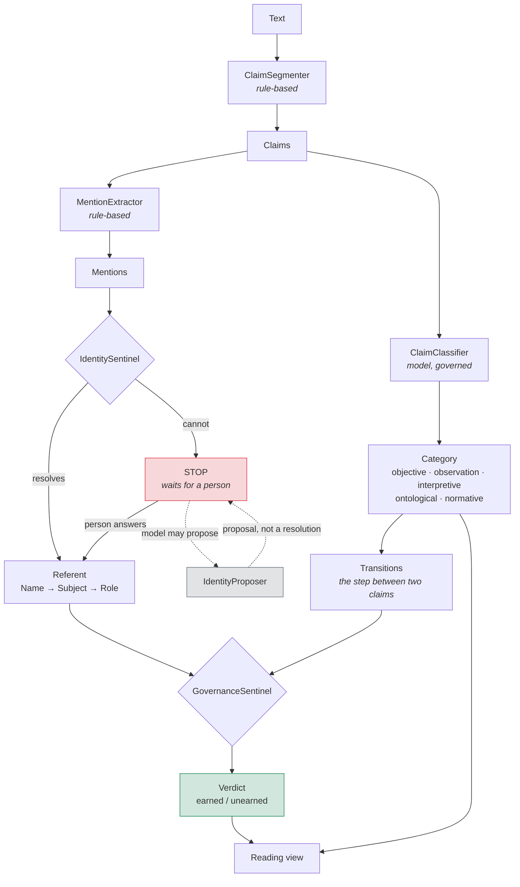
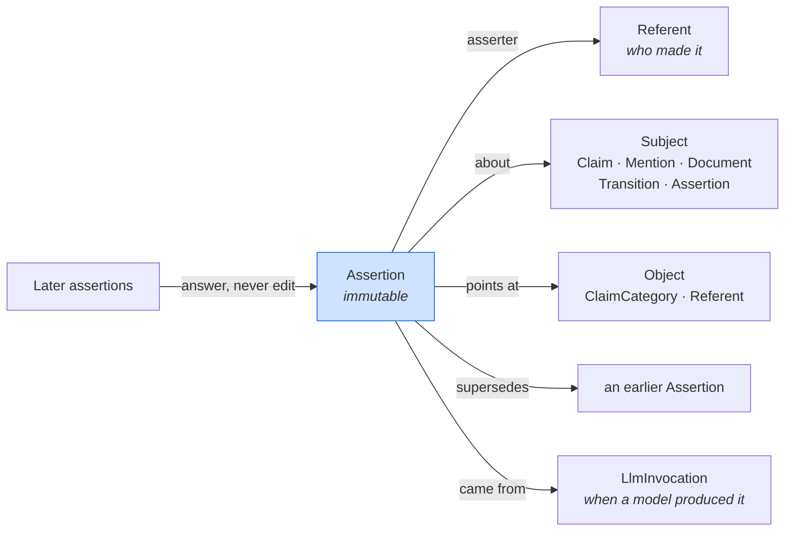
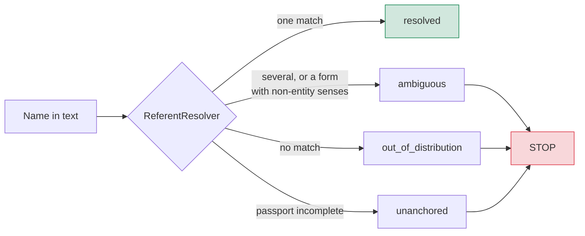
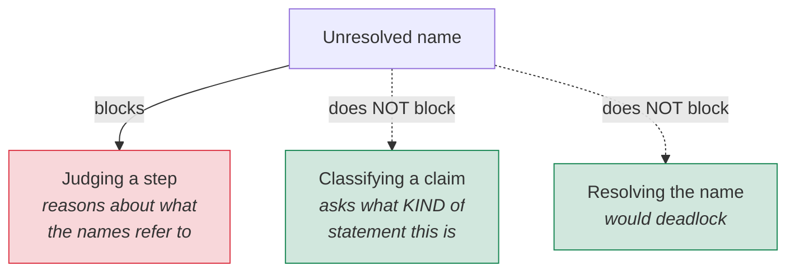
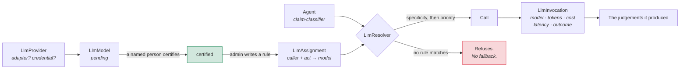
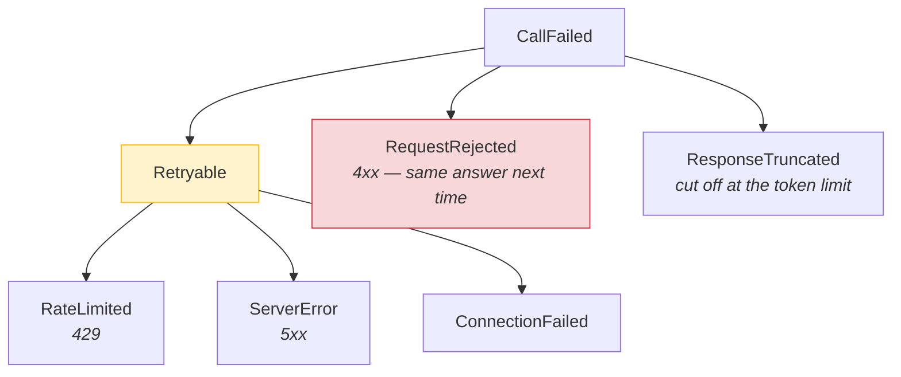
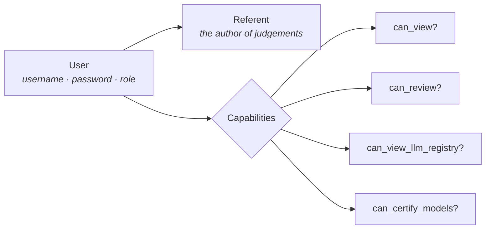
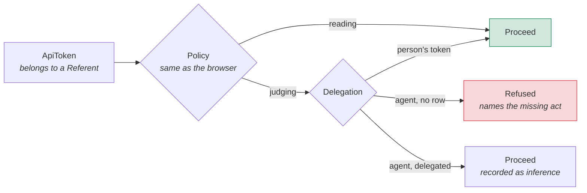
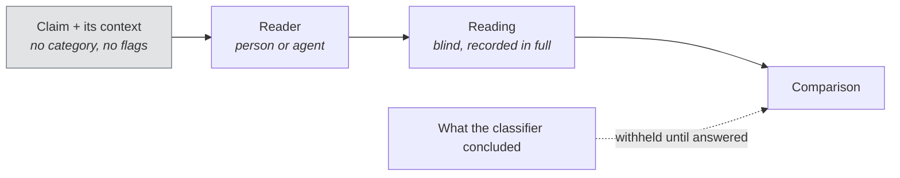

# Architecture

How the system is put together, and why the seams fall where they do.

[`THESIS.md`](THESIS.md) argues the position; [`CONOPS.md`](CONOPS.md) says what
the system is for; this document says how it is built. Decisions with rejected
alternatives live in [`decisions/`](decisions/).

---

## The shape of it

Text arrives, is cut into claims, and every capitalised string in it is
proposed as a name. Nothing is predicated of a name until someone has said what
it refers to. Claims are typed by kind; the steps *between* claims are judged
for whether the promotion from one kind to the next was earned.



**Structure is not a claim.** A heading, a table row, a rule — part of the
document, but not an assertion about anything. These are marked rather than
dropped, so the text stays in the record and still renders; what changes is that
nothing asks them what kind of claim they are, and no step is drawn through
them, because a heading is where an argument restarts rather than a move within
one.

Where the text is markdown, this is decided with certainty: a row is a table row
because a delimiter row says the block is a table. Where it is plain prose, a
deliberately timid heuristic applies — an *isolated* short unterminated line,
never a run of them. The timidity is earned: the obvious rule swallowed 49 of
one document's 306 claims, including the framework's own category definitions,
because a table had been flattened into bare newlines before it ever arrived.

A **lead-in** is structure too — a short line ending in a colon, alone on its
line ([ADR 16](decisions/0016-a-colon-line-is-a-lead-in.md)). `Postscript:`
asserts nothing and the claim is the text underneath. This one has a cost the
ADR states rather than argues away: `Polanyi reverses it:` does assert
something and is hidden anyway, because telling the two apart means deciding
whether a line *predicates*, and that is interpreting the text.

The rule that reaches these was broken for a while in a way nothing announced.
`own_line?` tested whether the following character was a newline, so a line
carrying a **trailing space** was not alone on its line and every heading rule
silently declined to reach it.

Two things to notice. The **rule-based** stages are deliberately not
model-backed — segmentation and extraction decide what counts as a claim and
what counts as a name, and every later judgement inherits those decisions
([ADR 9](decisions/0009-ingest-is-deterministic.md)). And the identity STOP
blocks the path to *governance* but not to *classification*
([ADR 11](decisions/0011-the-lock-guards-predication.md)).

---

## One record type

A sentinel's flag, a reviewer's dismissal, a verdict on a step, a
classification, an identity resolution — all the same object. Immutable,
attributed, evidenced, supersedable, challengeable
([ADR 8](decisions/0008-one-epistemic-record-type.md)).



An assertion may be *about* another assertion — that is what makes the structure
recursive, and it is how a flag is answered without the flag being altered.

An assertion is an **event**, not a property. It records that a claim *was
made* — never that the claim was correct. An assertion may be perfectly
authentic and entirely mistaken, and the architecture holds both facts at once.

Nothing is edited. `readonly? = persisted?` is enforced at the model, so an
error is never erased; it is *answered* by a later assertion that references it.

### Everything downstream is derived

`claims`, `mentions` and `relationships` carry no `status`, `verdict` or
`category` column at all. Each of these is read from the standing assertions.

| Question | Answered by |
|---|---|
| What category is this claim? | its standing `classify` assertion |
| Is this mention resolved? | whether a standing `resolve` assertion names it |
| Was this step earned? | the newest standing verdict assertion on the transition |
| Is this flag still open? | whether a standing `accept`/`reject` answers it |
| Is the document locked? | whether any STOP flag stands undisposed |

A stored copy could disagree with the record it summarises. Derivation costs
queries and buys the guarantee that it cannot.

The registry is different, and deliberately so: `llm_providers.status`,
`llm_models.certification_status` and `llm_invocations.status` are ordinary
columns. They record configuration and what happened on the wire, not
judgements about a text, so there is nothing for them to drift out of step with.

---

## Identity precedes reasoning — about an entity

A name arriving without established reference is *Entity Noise*. The Cognitive
Passport is `Name → Subject → Role`, and a partial passport is not a weaker
anchor — it is no anchor.



The resolver is deterministic on purpose: its job is to refuse to guess, and a
probabilistic resolver would reintroduce the guess it exists to prevent.

### What a STOP actually blocks

This is the seam most likely to be misread, so it is drawn explicitly.



*"Polanyi said we can know more than we can tell"* is an objective claim
whichever Polanyi it is. Gating classification on resolution made ordinary prose
unreadable — one essay produced 204 blocking questions and could not be typed at
all ([ADR 11](decisions/0011-the-lock-guards-predication.md)).

### One entity, several names

`Polanyi`, `Polayani` and `Michael Polanyi` are one philosopher. Grounding them
separately would break object constancy over a transposed letter, so a name can
be declared **another spelling** of an existing referent. The alias is recorded;
the document's text is never corrected, because the misspelling is evidence that
it was there.

---

## Action polarity — what a claim does, and whether that can be read

The G3/G7 Matrix reads verbs as forces applied between nodes rather than as
grammatical decoration. The difficulty is Freud's: a surface negation can carry
the very intent it appears to deny. *"Nechceš kávu?"* — *"Don't you want
coffee?"* — is an offer in Slovak and is read as refusal through an
English-shaped frame.

So `ClaimPolarity` reads **surface** polarity only, deterministically, and says
so. Its useful output is not the reading but the constructions where the reading
cannot be trusted — a negative question, a double negative, a negated modal.
`SituationalSentinel` raises a **concern** on those, never a STOP: an unreadable
direction does not make a document ungroundable the way an unresolved name does,
because nothing is yet predicating a direction of anything.

Litotes is a recorded miss. *"It is not uncommon"* reads as denied and means
roughly the opposite, and no structural rule separates `uncommon` from
`understood`, `universe` or `information`. Detecting it needs a lexicon of
negative-prefixed words — world knowledge, which is what this layer exists not
to guess at. The gap is documented and pinned by a spec rather than papered over.

The enforceable claim is narrow, in the manner of gap invariance:

> **Polarity invariance.** Negating a claim does not change what KIND of claim
> it is. *"The wall represented fear"* is interpretive; so is *"The wall did not
> represent fear."*

A classifier whose category moves under negation is reading what a claim says
rather than what it does. `PolarityInvariance` checks it by construction — two
classifications, no opinion — and abstains where a negation cannot be built
structurally, because a paraphrase would put the checker's own rewrite
underneath the result.

---

## The model is fenced

Which model answers is a governed decision, not a constant. An uncertified model
is unreachable — nobody's judgement runs because a constant named it.



There is deliberately **no fallback** to "the cheapest certified model". A
fallback of that shape means a call silently runs on a model nobody chose for
it, and the invocation record would be the only place that fact appears.

Two conditions are kept apart because they fail differently: a provider needs an
**adapter** (can the code call it?) and a **credential** (may it?). A provider
without an adapter may be registered but never certified — vouching for a model
this application cannot reach would claim a capability that does not exist.

### Adapters, not vendors

Callers speak one interface and one error taxonomy, so nothing upstream knows
which vendor was on the other end.



The decision that depends on this — wait and retry, or stop — is the same
whoever was called.

`max_tokens` means the size of the **answer**, for every adapter. Gemini charges
its thinking against the same budget, so its adapter adds a thinking allowance
on top rather than making each caller know which providers think. Three separate
services were sized wrong before that floor existed, each found by a run failing
— which is the argument for putting provider quirks in the adapter rather than
in the caller's memory of them. A retry re-runs the whole document, which is cheap: a claim
with a standing classification is skipped, so it resumes rather than repeating
calls already paid for.

### Where the model is asked, and for what

| Agent | Asks the model | Does not decide |
|---|---|---|
| `claim-classifier` | what kind of claim each statement is | may abstain; below the confidence floor the proposal is discarded |
| `identity-proposer` | what an unfamiliar name refers to | proposes only — a STOP lifts when a **person** accepts |

Both record their output as assertions by their own referent: inference,
attributable, challengeable, never a finding. The proposer is deliberately not
the `identity-sentinel` that would accept its proposal — an actor that proposed
the ground and then accepted it would be the conflation Chapter 6 forbids.

---

## Authorisation and provenance are separate

A **User** carries the credential and the role. Its **Referent** carries the
authorship. Every judgement attributes to the Referent, so credentials never
appear in the audit trail.



Policies ask capability questions, never role questions, so a new role is a new
composition rather than a new branch in every policy — and an `ApiToken` answers
the same questions the same way, through one `Capabilities` module, so there is
no second authorisation path for machines.

| Role | May |
|---|---|
| `viewer` | read documents, claims and flags |
| `reviewer` | + submit texts, run analyses, answer flags, ground names |
| `auditor` | read + the model registry and every invocation |
| `admin` | everything, including certifying and revoking models |

### An agent acts as itself

A token belongs to a **Referent**, not to a User. Whatever drives the API
attributes its judgements to itself, so an agent operating the review surface can
never leave a record saying a person decided.

Two gates, and both must pass. The **policy** — the same Pundit policies the
browser uses. And, for judgements only, a **delegation**: a standing decision by
a named person that this class of judgement may be made with nobody present.
Absence of a row is refusal.



**TEI inversion.** Alexandra Krížová's rule: authority *tightens* the
justification required of it rather than loosening it. Most systems run the
other way — a powerful actor is trusted further and asked for less — and that is
the path by which a covert policy gets installed one reasonable command at a
time. So `scrutiny = act_weight + breadth`, and the wider and heavier a
delegation, the more it must carry to exist at all: a rationale, then an expiry,
then a bounded one. A delegation granted by an agent is invalid however wide its
role. Nothing here makes a powerful delegation impossible; it makes one unable to
be made quietly.

### And afterwards

TEI inversion checks a delegation when it is **granted** and then stops looking.
A covert policy does not arrive as one suspicious command — it arrives as a slow
shift across many defensible ones, which is the shape a grant-time check cannot
see.

`TemporalDriftAudit` compares an actor's recent decisions against **its own**
earlier ones — not against a population, and not against a rule about how a
reviewer ought to behave. Divergence is total variation distance, which reads in
words as *the share of decisions that would have to move to reconcile the two
periods*. Below twenty decisions in either period it reports **incomparable**
rather than no drift.

It never revokes, blocks or re-judges, and it does not call drift wrongdoing: a
reviewer who gets better at the job drifts too. Readings are recorded whether or
not they are notable, because a record of only the alarming ones cannot tell you
the quiet ones were ever taken.

---

## One reading is a sample

Re-running a whole document changed **half the steps it flagged** — Jaccard 0.51
between two passes under identical conditions. So a single machine reading is
not a finding, and the difference has to be visible rather than assumed.

Asking three times and taking a majority helped, and less than hoped: 0.51 to
0.60 for three times the cost. Two later measurements separated what that figure
was mixing. **0.70** is how often two passes flag the same step *when both can
judge it*; the rest was coverage — one pass abstaining on an endpoint the other
typed. And coverage is itself unstable, the same classifier leaving 30 claims
unread on one pass and 51 on the next.

A claim's category is now what a **strict majority** of its readings say. A
plurality does not decide: two of five is not agreement. Where the readings
reach no majority the claim is left unclassified, which is what abstention
already means here — better than reporting whichever reading happened to be last.

A person's judgement is not a vote among the others. It settles the question —
but an **abstention is not a judgement**. A person saying "I cannot tell" is
recorded as a reading and leaves whatever the machine agreed on standing, rather
than blanking a category three readings had settled.

Readings taken **blind**, for comparison rather than as part of the
classification pass, are recorded in full and counted in no tally. Merging a
second judge's readings into the first judge's majority would be two instruments
reported as one measurement — the error this framework exists to catch,
committed against itself.

Readings are **additive**. Nothing is overwritten, each reading is its own
assertion, and a document already carrying one reading run again at three buys
two more. A decline counts as an asking, so a claim the classifier keeps
refusing does not cost a call on every pass.

Every finding carries how firmly it stands, **bounded by its least settled
endpoint** — a step between a claim typed 3 of 3 and one typed 2 of 3 is only as
settled as the second. A flag reading `1 of 1` and one reading `3 of 3` are
different objects, and the interface used to render them identically.

---

## Measuring the system itself

Three findings about a model once existed only in a conversation and in
invocation rows that recorded that a call happened without recording what it
showed. A system insisting every judgement be attributable had no home for a
judgement about itself.

A measurement is therefore an assertion about the `LlmModel`, made by the
`baseline-recorder`, superseded by a better measurement rather than overwritten.
Stored with it: the sample, the conditions, the code revision, and the caveats.
A rate on its own cannot be compared to anything — the next reading would differ
and nobody could say whether the model changed, the code changed, or the
question did.

`Baseline.compare` refuses to call two readings comparable when their conditions
differ, and reports a criterion measured once but not twice rather than dropping
it: a measurement that was not repeated is not a measurement that agreed.

### The document is derived, like everything else

This section used to carry a hand-written table of the figures, and it had
drifted within a day — describing seven measurements while the record held
eight. A stored summary disagreeing with what it summarises is the failure the
whole project is built around, occurring in its own documentation.

So [`BASELINE.md`](BASELINE.md) is **generated** from the recorded measurements,
the way `Claim#category` and `Transition#verdict` are derived:

```
rake "alexicon:baseline[v1]"
```

Every figure, sample, condition, caveat and code revision comes from the
assertion it was recorded in. Three things stay editorial — the question a
measurement asks, what its number means, and which figure leads the heading —
and each degrades to silence for a criterion it has no entry for, so a
measurement recorded tomorrow still renders.

Generating it surfaced what the hand-written version had smoothed over: v1's
figures were taken at **five different code revisions**, two with uncommitted
changes in the tree. The header says so now, and each section states its own.

**Two baselines exist**, and they are not revisions of each other.
[v1](BASELINE.md) has twelve measurements; [v2](BASELINE-v2.md) was taken after
the segmentation changed, over the same source text re-ingested, and its sample
is different by construction — 293 substantive claims against 306.
`Baseline.compare` refuses the pair and names `segmentation` as the condition
that diverged, which is the machinery working rather than failing.

Both were measured against **four** categories. A fifth has since been added
([ADR 17](decisions/0017-a-normative-category.md)), so every figure in them came
from a four-way choice, and any baseline from now on must carry the category
count in its conditions.

---

## A second judge

Nine of v1's twelve figures are the system agreeing or disagreeing with itself.
A model can be perfectly consistent and consistently wrong, and no amount of
self-consistency can tell those apart. The only thing that can is a reader who
did not produce the answer being checked.

`BlindReading` is that surface, for a person through the browser and for an
agent through the API. What makes it worth anything is enforced rather than
intended: asking it what the machine concluded, about a claim the reader has not
yet answered, **raises**. A view cannot leak what it cannot obtain, and the
comparison contains only claims already answered — reaching it early shows less
rather than showing the answers.



The spec does not check for wording — every category name is on the page as an
option, so no wording check could prove anything. It asserts the page renders
**byte-identically** whether or not the classifier has typed the claim.

Agreement is rated over claims **both** judges typed. Counting a claim one side
abstained on would mix coverage into correctness.

What it has produced so far: **48.6%** agreement on first-person narrative and
**75.8%** on argumentative prose, against a classifier that reproduces *itself*
87.9% of the time. Consistency and agreement are not the same property. The
disagreements are not scattered — in narrative they concentrate on whether a
reported action is objective or observation; in argument the pressure moves to a
different boundary entirely, which suggests one definition of *observation* is
being asked to do two jobs.

None of that is correctness. Two judges agreeing tells you they agree. Nothing
here has yet compared the system against a **person's** reading of the same
text, which is the measurement that would let any of the other figures be read
as more than consistency.

---

## Reading

The review surface shows the working memory of the analysis: identity cards,
claim rows, step rows. That is the wrong artifact to hand a person, so
`DocumentReading` slices the body on claim offsets and returns the text in
order, with the judgements attached to the sentences they concern.

It generates **no prose**. A model retelling the document in its own words would
read as more authoritative than the record while being less accountable than it,
and the retelling would become the artifact people cite — fluency mistaken for
grounding ([ADR 13](decisions/0013-the-reading-view-writes-no-prose.md)).

The obligation is pinned by spec: the segments reassemble into *exactly* the
body, and cover it once.

---

## Layout

```
app/
  models/          the record types; almost all state is derived here
  services/
    claim_segmenter · mention_extractor · casing_evidence   rule-based ingest
    referent_resolver · identity_sentinel                   the input boundary
    identity_proposer                                       model proposes names
    claim_classifier · document_classification              model types claims
    governance_sentinel · domain_sentinel · sentinels/      judges the steps
    llm_clients/ · llm_resolver                             the fenced model layer
    document_reading                                        the reading view
  jobs/            long analyses, with live progress over Turbo Streams
  policies/        Pundit; capability questions only
```

## Running it

See [`README.md`](../README.md) for setup. The postures worth knowing before
first use: **nothing classifies until a model is certified and routed**, and
**nothing routes anywhere by default** — both are refusals by design, not
missing configuration.
