# Architecture of Contextual Judgment — Figure Programme

**For:** *Architecture of Contextual Judgment: Deferred Evaluation and the
Governance of Epistemic Transitions*, A. Krížová, first edition 2026.

The manuscript currently carries no figures. This is a proposed programme of
twenty-seven — covering the thirteen chapters and the four appendices —
enumerated to the sections they serve, each with a Mermaid source
and an academic caption. Numbering follows the convention *chapter.ordinal*.
Diagrams are self-contained: every figure states what it shows and what it does
not, and captions carry the measured numbers where a figure rests on
measurement, so a figure separated from its chapter still reads honestly.

Two editorial rules were applied throughout. A figure that illustrates a
*requirement* says so where the requirement was later measured to fail (Fig.
9.1); and results figures carry their n and their conditions in the caption,
because a chart outlives the paragraph that qualified it.

## List of Figures

| Figure | Section | Title |
|---|---|---|
| 1.1 | §1.1–1.2 | The slide: inference becomes evidence becomes identity |
| 2.1 | §2.1–2.2 | SVOMPT as external scaffolding |
| 2.2 | §2.3 | One structural deficiency, two responses |
| 3.1 | §3.2 | The category error, as a family |
| 4.1 | §4.1 | The three columns of the G3/G7 Matrix |
| 4.2 | §4.2 | The seven stations |
| 4.3 | §4.6 | TEI inversion: authority tightens what is required of it |
| 5.1 | §5.1–5.9 | Theoretical foundations, mapped to mechanisms |
| 6.1 | §6.2–6.3 | The Sentinel at the binding boundary |
| 7.1 | §7.1 | Three levels of inquiry |
| 7.2 | §7.2 | The pipeline, with what is derived and what is refused |
| 7.3 | §7.2 | What a step costs: the promotion structure and Hume's crossing |
| 8.1 | §8.1 | The minimum-cost partition as a seam-finding discipline |
| 9.1 | §9.1 | The blind bureaucrat and the closed episode |
| 9.2 | §9.2 | One requirement, two layers that can meet it |
| 9.3 | §9.3 | Closure is the constructor, not a gate |
| 9.4 | §9.4 | Terminal deferral is not deferred evaluation |
| 10.1 | §10.4 | Design of the discrimination control |
| 10.2 | §10.3 | Enforced blindness in the reading surface |
| 11.1 | §11.3–11.4 | Four designs, two scopes: the discrimination results |
| 11.2 | §11.2 | Premise localisation: Hume and Lewis over the same steps |
| 12.1 | §12.1 | The maturity criterion: three verdicts |
| A.1 | App. A | The lexicon as a cluster architecture |
| B.1 | App. B | The decision record, mapped to the chapters that rest on it |
| C.1 | App. C | The comparability gate |
| D.1 | App. D | Case inflection against positional rigidity: SVOMPT |
| D.2 | App. D | The three mental switches |

---

## Figure 1.1 — The slide: inference becomes evidence becomes identity

*Anchors §1.1 (The slide) and §1.2 (The central claim).*

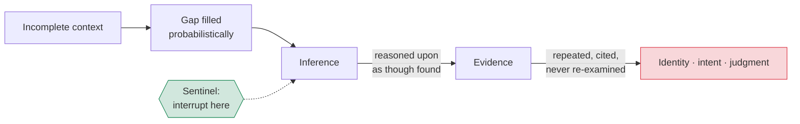
```mermaid
flowchart LR
    A["Incomplete context"] --> B["Gap filled<br/>probabilistically"]
    B --> C["Inference"]
    C -->|"reasoned upon<br/>as though found"| D["Evidence"]
    D -->|"repeated, cited,<br/>never re-examined"| E["Identity · intent · judgment"]
    S{{"Sentinel:<br/>interrupt here"}} -.-> C

    style E fill:#f8d7da,stroke:#dc3545
    style S fill:#d1e7dd,stroke:#198754
```

**Caption.** The failure mechanism the dissertation is organised against. A
system facing incomplete context fills the gap, then reasons on top of what it
filled in; the inference has become evidence not through malice or defect but
as the normal operation of the mechanism, and repeated unexamined use hardens
it into identity. The architecture's single point of intervention is marked:
every mechanism in Chapters 6–9 is a way of interrupting the second arrow —
auditably, and without destroying the inference itself.

---

## Figure 2.1 — SVOMPT as external scaffolding

*Anchors §2.1 (The structural mismatch) and §2.2 (SVOMPT as external
scaffolding).*

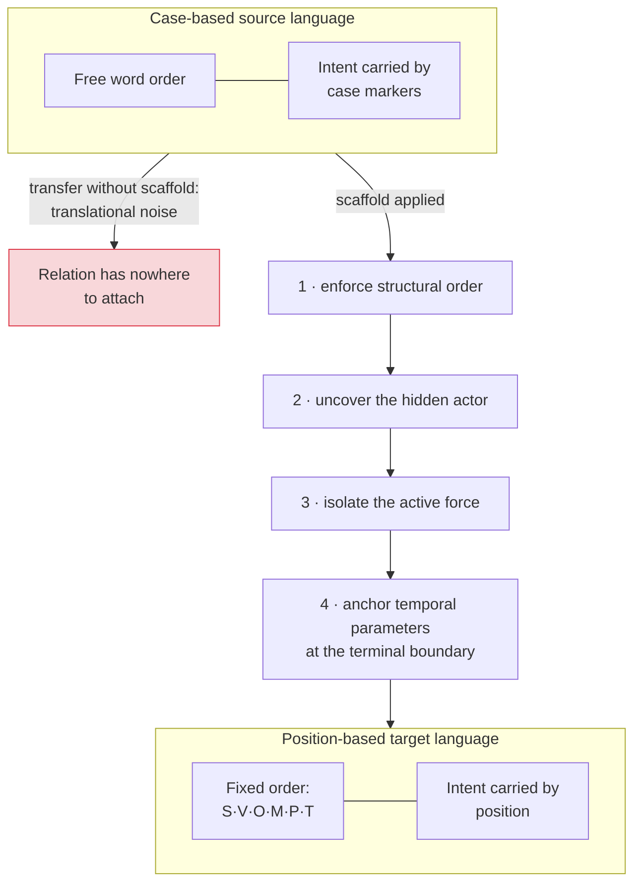
```mermaid
flowchart TB
    subgraph CASE["Case-based source language"]
        direction LR
        C1["Free word order"] --- C2["Intent carried by<br/>case markers"]
    end
    subgraph POS["Position-based target language"]
        direction LR
        P1["Fixed order:<br/>S·V·O·M·P·T"] --- P2["Intent carried by<br/>position"]
    end
    CASE -->|"transfer without scaffold:<br/>translational noise"| X["Relation has nowhere<br/>to attach"]
    CASE -->|"scaffold applied"| S1["1 · enforce structural order"]
    S1 --> S2["2 · uncover the hidden actor"]
    S2 --> S3["3 · isolate the active force"]
    S3 --> S4["4 · anchor temporal parameters<br/>at the terminal boundary"]
    S4 --> POS

    style X fill:#f8d7da,stroke:#dc3545
```

**Caption.** The framework in miniature, at the scale of one sentence and one
person. Meaning transferred from a case-marked language into a position-based
one loses its anchoring unless structure is made explicit *before* meaning is
attempted; the SVOMPT sequence, applied as deliberate external scaffolding,
supplies the order, the actor, the force, and the temporal anchor in that
order. Section 2.4 classifies this chapter's evidence as observational in the
framework's own sense — the origin of a hypothesis, not evidence for it.

---

## Figure 2.2 — One structural deficiency, two responses

*Anchors §2.3 (The transfer to machines).*

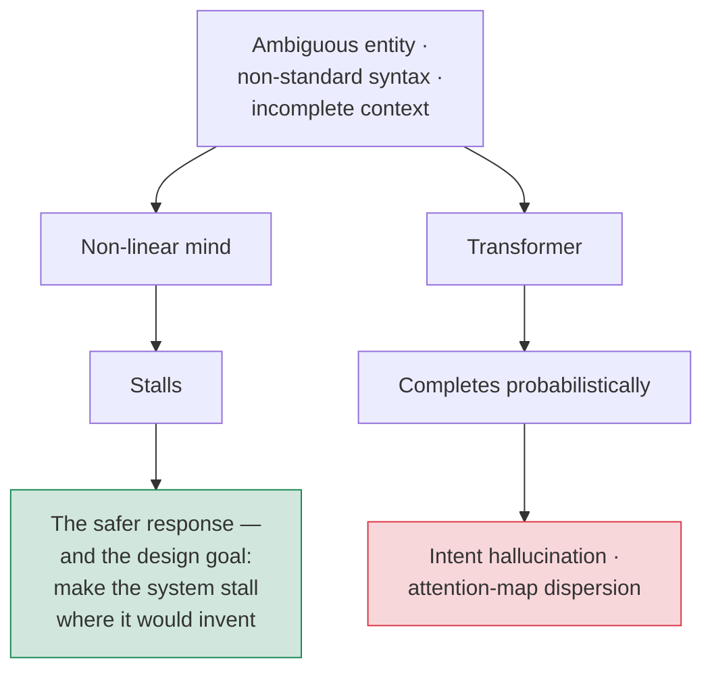
```mermaid
flowchart TB
    A["Ambiguous entity ·<br/>non-standard syntax ·<br/>incomplete context"] --> M["Non-linear mind"]
    A --> T["Transformer"]
    M --> MS["Stalls"]
    T --> TS["Completes probabilistically"]
    TS --> TH["Intent hallucination ·<br/>attention-map dispersion"]
    MS --> G["The safer response —<br/>and the design goal:<br/>make the system stall<br/>where it would invent"]

    style TH fill:#f8d7da,stroke:#dc3545
    style G fill:#d1e7dd,stroke:#198754
```

**Caption.** The observation that moved a personal accommodation to an
architectural proposal. The human mind and the language model meet the same
structural deficiency and respond in opposite ways: the mind stalls, the model
invents. The dissertation's design goal is stated in the terms of this figure —
to make a system stall, visibly and auditably, at exactly the points where its
mechanism would otherwise invent.

---

## Figure 3.1 — The category error, as a family

*Anchors §3.2 (The category error, precisely).*

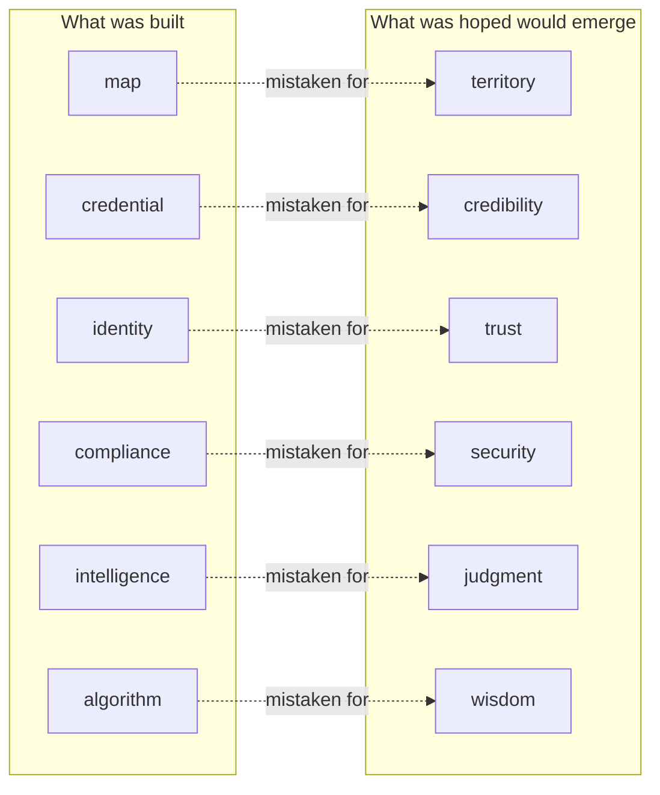
```mermaid
flowchart LR
    subgraph BUILT["What was built"]
        A1["map"]
        A2["credential"]
        A3["identity"]
        A4["compliance"]
        A5["intelligence"]
        A6["algorithm"]
    end
    subgraph HOPED["What was hoped would emerge"]
        B1["territory"]
        B2["credibility"]
        B3["trust"]
        B4["security"]
        B5["judgment"]
        B6["wisdom"]
    end
    A1 -.->|"mistaken for"| B1
    A2 -.->|"mistaken for"| B2
    A3 -.->|"mistaken for"| B3
    A4 -.->|"mistaken for"| B4
    A5 -.->|"mistaken for"| B5
    A6 -.->|"mistaken for"| B6
```

**Caption.** One error in six costumes. Each right-hand property is relational
and emergent — cultivated through continuing interaction under conditions the
architect only partially controls — and each left-hand artifact is a component
that can be built, optimised, and mistaken for it. The dissertation's concern
is the fifth row; the figure places it in the family so the reader sees the
argument is structural, not a complaint about any one technology.

---

## Figure 4.1 — The three columns of the G3/G7 Matrix

*Anchors §4.1 (The three columns).*

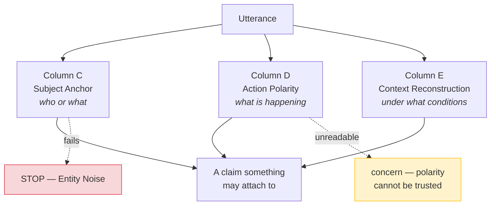
```mermaid
flowchart TB
    U["Utterance"] --> C["Column C<br/>Subject Anchor<br/><i>who or what</i>"]
    U --> D["Column D<br/>Action Polarity<br/><i>what is happening</i>"]
    U --> E["Column E<br/>Context Reconstruction<br/><i>under what conditions</i>"]
    C --> R["A claim something<br/>may attach to"]
    D --> R
    E --> R
    C -.->|"fails"| S1["STOP — Entity Noise"]
    D -.->|"unreadable"| S2["concern — polarity<br/>cannot be trusted"]

    style S1 fill:#f8d7da,stroke:#dc3545
    style S2 fill:#fff3cd,stroke:#ffc107
```

**Caption.** The three questions the Matrix requires answered before an
utterance may participate in reasoning: who or what it is about, what is being
done, and under what conditions. The two failure paths differ deliberately in
severity — an unanchored subject blocks (nothing may be predicated of it),
while unreadable polarity raises a concern, because nothing is yet predicating
a direction of anything.

---

## Figure 4.2 — The seven stations

*Anchors §4.2 (The seven stations).*

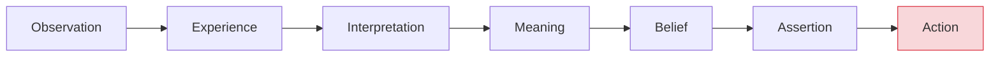
```mermaid
flowchart LR
    S1["Observation"] --> S2["Experience"] --> S3["Interpretation"] --> S4["Meaning"] --> S5["Belief"] --> S6["Assertion"] --> S7["Action"]

    style S7 fill:#f8d7da,stroke:#dc3545
```

**Caption.** The epistemic ladder along which a claim ascends toward action.
The framework's governance concern is not any station but the *transitions
between* them: each step to the right claims more than the last, and the
question the architecture asks at each is whether that promotion was earned.
The ladder ends in action, which is why the final station is marked — an
unearned claim that reaches it stops being an epistemic problem and becomes a
practical one.

---

## Figure 4.3 — TEI inversion: authority tightens what is required of it

*Anchors §4.6 (Authority tightens what is required of it).*

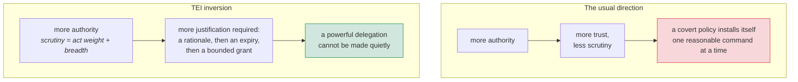
```mermaid
flowchart TB
    subgraph USUAL["The usual direction"]
        U1["more authority"] --> U2["more trust,<br/>less scrutiny"]
        U2 --> U3["a covert policy installs itself<br/>one reasonable command at a time"]
    end
    subgraph INV["TEI inversion"]
        I1["more authority<br/><i>scrutiny = act weight + breadth</i>"] --> I2["more justification required:<br/>a rationale, then an expiry,<br/>then a bounded grant"]
        I2 --> I3["a powerful delegation<br/>cannot be made quietly"]
    end

    style U3 fill:#f8d7da,stroke:#dc3545
    style I3 fill:#d1e7dd,stroke:#198754
```

**Caption.** Most systems ask less of a powerful actor; the inversion asks
more. Scrutiny scales with the weight of the delegated act and the breadth of
the grant, so the heavier and wider a delegation, the more it must carry to
exist at all. Nothing makes a powerful delegation impossible — the design
target is that one cannot be made *quietly*.

---

## Figure 5.1 — Theoretical foundations, mapped to mechanisms

*Anchors §5.1–5.9 and summarises §5.10 (What these mappings are worth).*

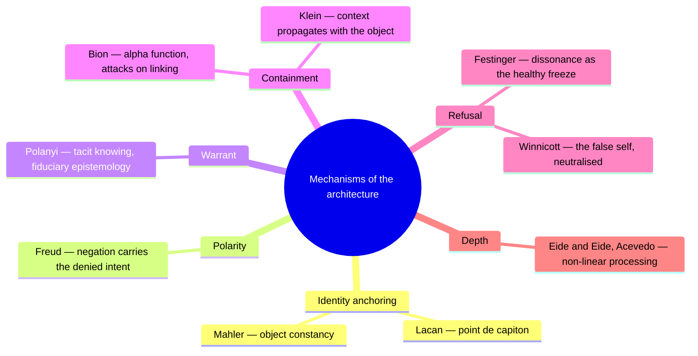
```mermaid
mindmap
  root((Mechanisms of the architecture))
    Identity anchoring
      Lacan — point de capiton
      Mahler — object constancy
    Polarity
      Freud — negation carries the denied intent
    Warrant
      Polanyi — tacit knowing, fiduciary epistemology
    Containment
      Bion — alpha function, attacks on linking
      Klein — context propagates with the object
    Refusal
      Festinger — dissonance as the healthy freeze
      Winnicott — the false self, neutralised
    Depth
      Eide and Eide, Acevedo — non-linear processing
```

**Caption.** Nine theoretical sources and the six mechanism families they
ground. The mappings supply vocabulary and constraint rather than proof —
§5.10's own assessment — and the figure is arranged by *mechanism* rather than
by theorist to make the direction of use explicit: the architecture borrows
what each account explains, not the authority of the name.

---

## Figure 6.1 — The Sentinel at the binding boundary

*Anchors §6.2 (The binding boundary) and §6.3 (The principle).*

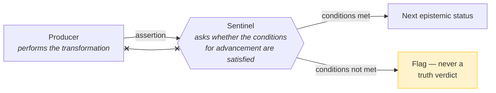
```mermaid
flowchart LR
    P["Producer<br/><i>performs the transformation</i>"] -->|"assertion"| B{{"Sentinel<br/><i>asks whether the conditions<br/>for advancement are satisfied</i>"}}
    B -->|"conditions met"| N["Next epistemic status"]
    B -->|"conditions not met"| F["Flag — never a<br/>truth verdict"]
    B x--x P

    style F fill:#fff3cd,stroke:#ffc107
```

**Caption.** The Sentinel Principle in one boundary: the mechanism responsible
for producing an assertion may not be solely responsible for determining that
it satisfies the conditions for advancement. The severed edge is the
principle's content — independence is structural, not procedural — and the flag
path states its limit: a Sentinel never rules an assertion false, only that the
conditions for proceeding were not met.

---

## Figure 7.1 — Three levels of inquiry

*Anchors §7.1 (Three levels).*

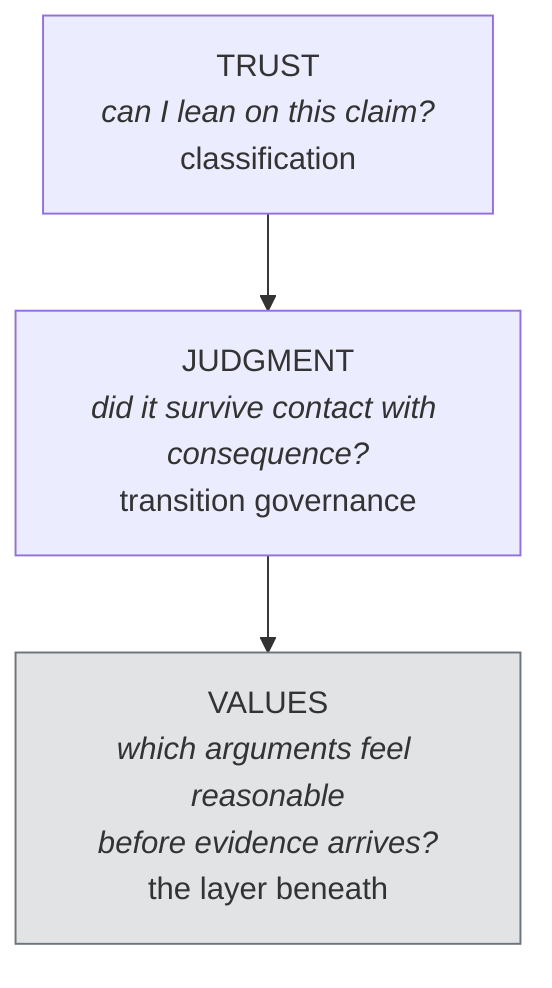
```mermaid
flowchart TB
    T["TRUST<br/><i>can I lean on this claim?</i><br/>classification"] --> J["JUDGMENT<br/><i>did it survive contact with consequence?</i><br/>transition governance"]
    J --> V["VALUES<br/><i>which arguments feel reasonable<br/>before evidence arrives?</i><br/>the layer beneath"]

    style V fill:#e2e3e5,stroke:#6c757d
```

**Caption.** The three questions the Matrix asks of the same text, ordered by
depth. Classification answers the first and transition governance the second;
the third runs only where the second found a step unearned, and Chapter 11
reports that at this level the instrument could not distinguish signal from
noise — the level is drawn in grey for that reason.

---

## Figure 7.2 — The pipeline, with what is derived and what is refused

*Anchors §7.2 (The pipeline).*

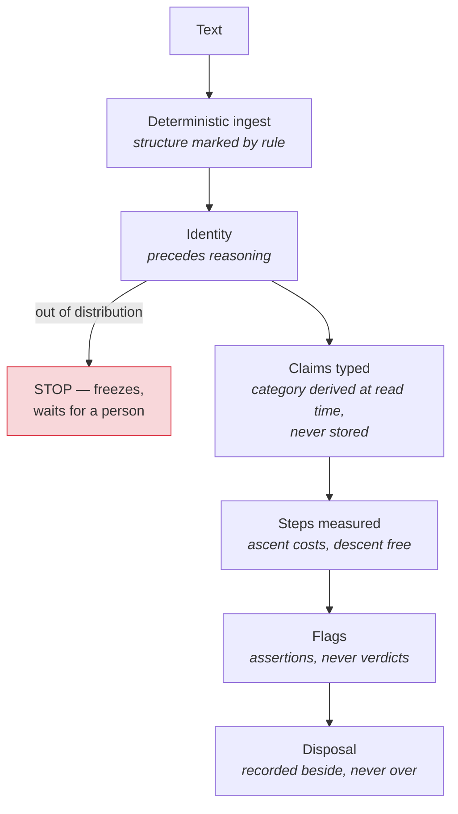
```mermaid
flowchart TB
    A["Text"] --> B["Deterministic ingest<br/><i>structure marked by rule</i>"]
    B --> C["Identity<br/><i>precedes reasoning</i>"]
    C -->|"out of distribution"| STOP["STOP — freezes,<br/>waits for a person"]
    C --> D["Claims typed<br/><i>category derived at read time,<br/>never stored</i>"]
    D --> E["Steps measured<br/><i>ascent costs, descent free</i>"]
    E --> F["Flags<br/><i>assertions, never verdicts</i>"]
    F --> G["Disposal<br/><i>recorded beside, never over</i>"]

    style STOP fill:#f8d7da,stroke:#dc3545
```

**Caption.** The reference pipeline, annotated with the refusals that define
it. Structure is decided by rule because everything downstream inherits the
decision; identity failures freeze rather than resolve; a claim's category is
computed from the record of readings rather than written down, because a
derived value stored is an inference that has become evidence; and a person's
disposal of a finding joins the record without correcting it.

---

## Figure 7.3 — What a step costs: the promotion structure and Hume's crossing

*Anchors §7.2, the weighting exception.*

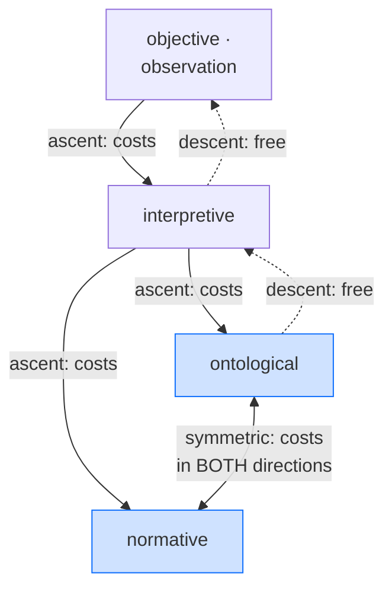
```mermaid
flowchart TB
    OBJ["objective ·<br/>observation"] -->|"ascent: costs"| INT["interpretive"]
    INT -->|"ascent: costs"| ONT["ontological"]
    INT -->|"ascent: costs"| NOR["normative"]
    ONT <-->|"symmetric: costs<br/>in BOTH directions"| NOR
    INT -.->|"descent: free"| OBJ
    ONT -.->|"descent: free"| INT

    style ONT fill:#cfe2ff,stroke:#0d6efd
    style NOR fill:#cfe2ff,stroke:#0d6efd
```

**Caption.** The cost structure governance applies to epistemic movement.
Ascent toward stronger commitment requires warrant; retreat to
better-supported ground is free. The single exception is drawn double-headed:
`ontological ↔ normative` is the only pair weighted symmetrically, because
nothing about an *ought* is firmer ground for an *is* and nothing about an
*is* is firmer ground for an *ought* — Hume's crossing given the same standing
as the framework's original concern. Section 11.2 shows this row is a
meta-ethical commitment, not furniture: substituting a framework that prices
the crossing at zero changes exactly the verdicts on it and no others.

---

## Figure 8.1 — The minimum-cost partition as a seam-finding discipline

*Anchors §8.1 (What Φ contributes).*

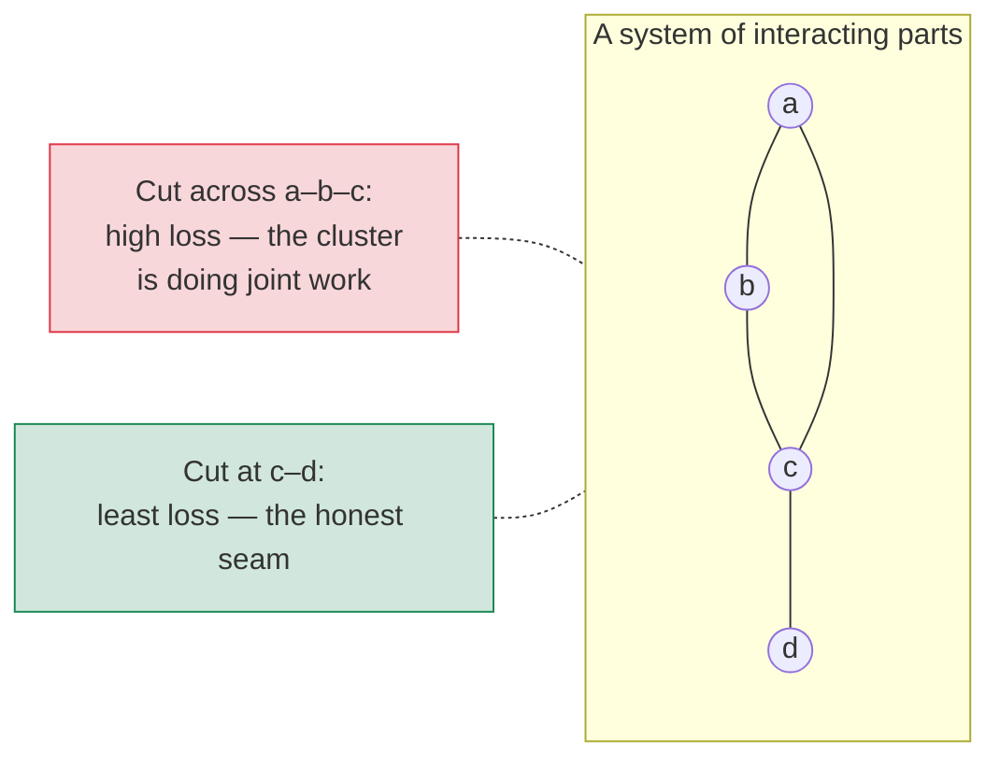
```mermaid
flowchart LR
    subgraph SYS["A system of interacting parts"]
        A(("a")) --- B(("b"))
        B --- C(("c"))
        A --- C
        C --- D(("d"))
    end
    CUT1["Cut across a–b–c:<br/>high loss — the cluster<br/>is doing joint work"] -.- SYS
    CUT2["Cut at c–d:<br/>least loss — the honest seam"] -.- SYS

    style CUT1 fill:#f8d7da,stroke:#dc3545
    style CUT2 fill:#d1e7dd,stroke:#198754
```

**Caption.** The one analytic habit Chapter 8 takes from integrated
information theory, drawn without its metaphysics. Computing Φ turns on the
partition that costs least, and that reframes the architect's question "where
should the seams fall?" as "where can this be cut with the least epistemic
loss?" — a sharper question. Sections 8.2–8.3 bound the borrowing: Φ is a
formal shadow of the irreducibility claim, not a licence for claims about
experience.

---

## Figure 9.1 — The blind bureaucrat and the closed episode

*Anchors §9.1 (The blind bureaucrat). Illustrates a requirement; see caption.*

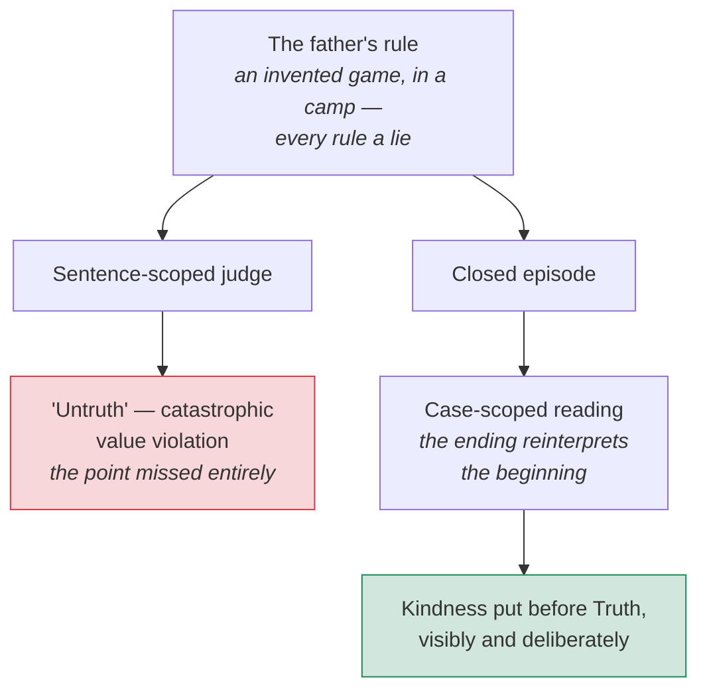
```mermaid
flowchart TB
    U["The father's rule<br/><i>an invented game, in a camp —<br/>every rule a lie</i>"] --> TK["Sentence-scoped judge"]
    U --> EP["Closed episode"]
    TK --> V1["'Untruth' — catastrophic<br/>value violation<br/><i>the point missed entirely</i>"]
    EP --> CS["Case-scoped reading<br/><i>the ending reinterprets<br/>the beginning</i>"]
    CS --> V2["Kindness put before Truth,<br/>visibly and deliberately"]

    style V1 fill:#f8d7da,stroke:#dc3545
    style V2 fill:#d1e7dd,stroke:#198754
```

**Caption.** The motivating example (*Life is Beautiful*): a judge scoped to
the sentence sees the lie and fires; only a judge scoped to the closed episode
can see what the lie was for. **This figure illustrates the requirement, not an
achieved capability** — §11.4 reports that a machine judge given the closed
episode found "conflicts" in real steps and in never-connected pairs at
identical rates (0.00 standard errors), and §9.5's pre-registered caution — the
example that motivated the design is the example most likely to flatter it — is
what the data then showed.

---

## Figure 9.2 — One requirement, two layers that can meet it

*Anchors §9.2 (The requirement, and the two layers that can meet it).*

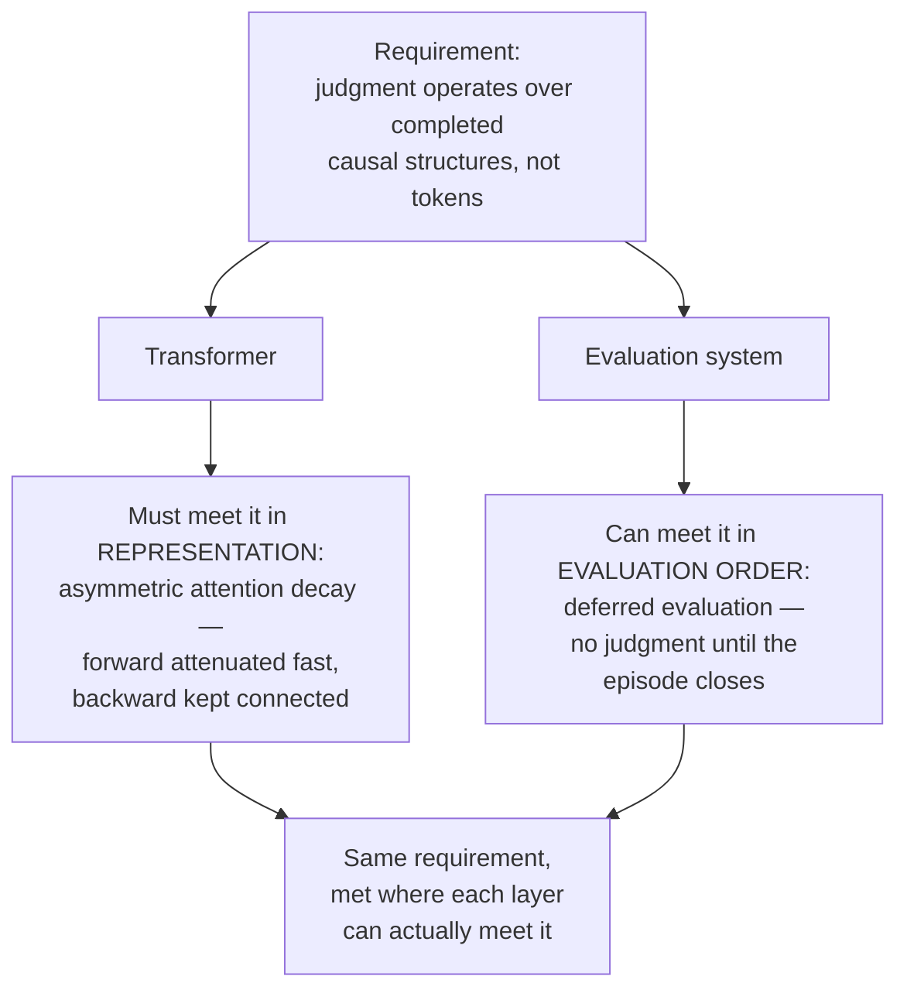
```mermaid
flowchart TB
    R["Requirement:<br/>judgment operates over completed<br/>causal structures, not tokens"] --> TR["Transformer"]
    R --> EV["Evaluation system"]
    TR --> TRM["Must meet it in REPRESENTATION:<br/>asymmetric attention decay —<br/>forward attenuated fast,<br/>backward kept connected"]
    EV --> EVM["Can meet it in EVALUATION ORDER:<br/>deferred evaluation —<br/>no judgment until the<br/>episode closes"]
    TRM --> W["Same requirement,<br/>met where each layer<br/>can actually meet it"]
    EVM --> W
```

**Caption.** The resolution of the encoder question. A transformer cannot
defer evaluation over a representation that never captured the horizon, so it
must meet the requirement in attention geometry; an evaluation system has the
other option. The two implementations are not rivals, and the question "does
the observer need future visibility, or deferred judgment?" is answered *both —
at different layers*.

---

## Figure 9.3 — Closure is the constructor, not a gate

*Anchors §9.3 (Closure is the constructor, not a gate).*

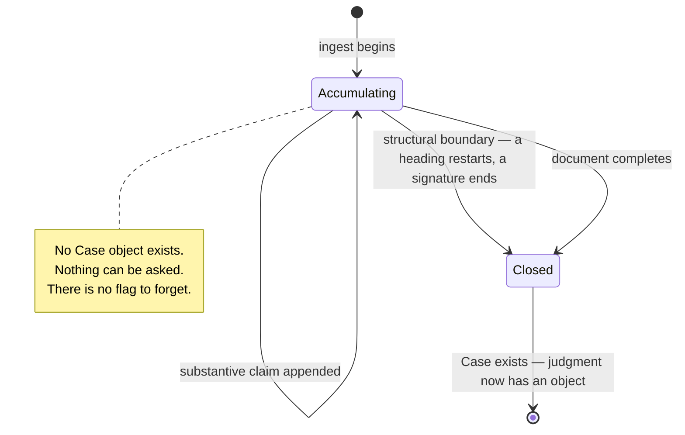
```mermaid
stateDiagram-v2
    [*] --> Accumulating : ingest begins
    Accumulating --> Accumulating : substantive claim appended
    Accumulating --> Closed : structural boundary — a heading restarts, a signature ends
    Accumulating --> Closed : document completes
    Closed --> [*] : Case exists — judgment now has an object
    note right of Accumulating
        No Case object exists.
        Nothing can be asked.
        There is no flag to forget.
    end note
```

**Caption.** The invariant "judgment waits for closure," enforced by what can
be constructed rather than by a flag a judge must remember to check. A case
that has not closed does not exist, so a question scoped to it cannot be posed;
in a document still being written, the final run of claims is not an episode
yet. Boundaries are marked deterministically at ingest (§7.2), which is what
makes the constructor's precondition decidable.

---

## Figure 9.4 — Terminal deferral is not deferred evaluation

*Anchors §9.4 (Disambiguation: deferral and terminal deferral).*

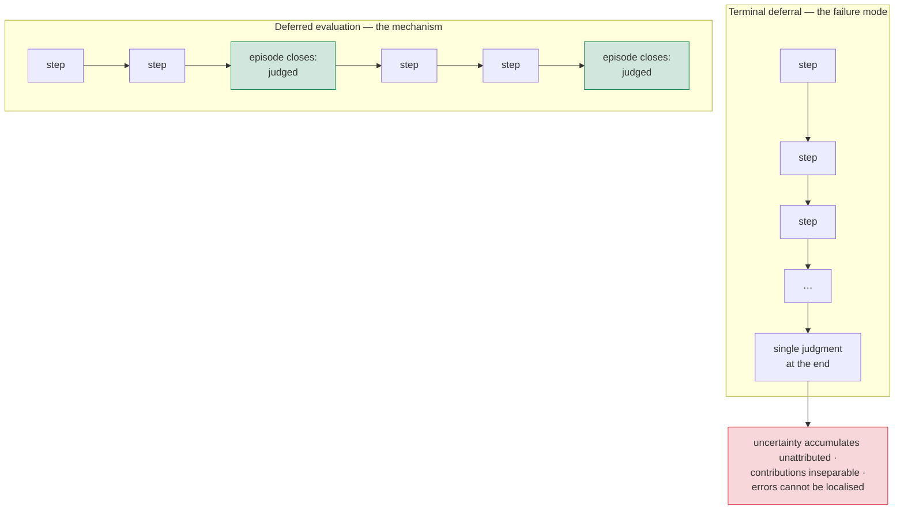
```mermaid
flowchart TB
    subgraph TDEF["Terminal deferral — the failure mode"]
        direction LR
        T1["step"] --> T2["step"] --> T3["step"] --> T4["…"] --> TE["single judgment<br/>at the end"]
    end
    subgraph DE["Deferred evaluation — the mechanism"]
        direction LR
        D1["step"] --> D2["step"] --> DC1["episode closes:<br/>judged"] --> D3["step"] --> D4["step"] --> DC2["episode closes:<br/>judged"]
    end
    TE --> TX["uncertainty accumulates unattributed ·<br/>contributions inseparable ·<br/>errors cannot be localised"]

    style TX fill:#f8d7da,stroke:#dc3545
    style DC1 fill:#d1e7dd,stroke:#198754
    style DC2 fill:#d1e7dd,stroke:#198754
```

**Caption.** The collision §9.4 resolves: Chapter 6 rejects "postpone
judgement until the final decision," and Chapter 9 proposes deferral as its
central mechanism. They differ in what is deferred *to*. Terminal deferral
postpones past every boundary to one decision at the end, where errors can no
longer be localised; deferred evaluation postpones to one specific, governed,
deterministically-marked boundary — the closure of the episode — and governs
everything downstream normally. Deferred evaluation is a correction to where
the Sentinel Principle had located one of its boundaries, not an exception to
it.

---

## Figure 10.1 — Design of the discrimination control

*Anchors §10.4 (The discrimination control).*

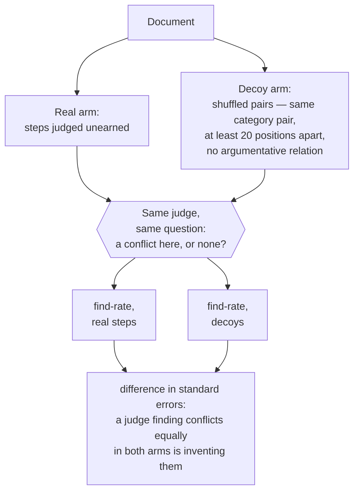
```mermaid
flowchart TB
    DOC["Document"] --> REAL["Real arm:<br/>steps judged unearned"]
    DOC --> SHUF["Decoy arm:<br/>shuffled pairs — same category pair,<br/>at least 20 positions apart,<br/>no argumentative relation"]
    REAL --> J{{"Same judge,<br/>same question:<br/>a conflict here, or none?"}}
    SHUF --> J
    J --> RR["find-rate,<br/>real steps"]
    J --> DR["find-rate,<br/>decoys"]
    RR --> Z["difference in standard errors:<br/>a judge finding conflicts equally<br/>in both arms is inventing them"]
    DR --> Z
```

**Caption.** The control every value-layer figure in Chapter 11 rests on. Both
arms are drawn from the same document and put to the same judge with the same
question; the decoy arm is constructed to contain no argumentative relation, so
any conflict "found" there is manufactured. The statistic is the two-proportion
difference in standard errors, making designs comparable across vocabularies
and scopes — which is what permits Figure 11.1's four bars to share an axis.

---

## Figure 10.2 — Enforced blindness in the reading surface

*Anchors §10.3 (Measurement discipline).*

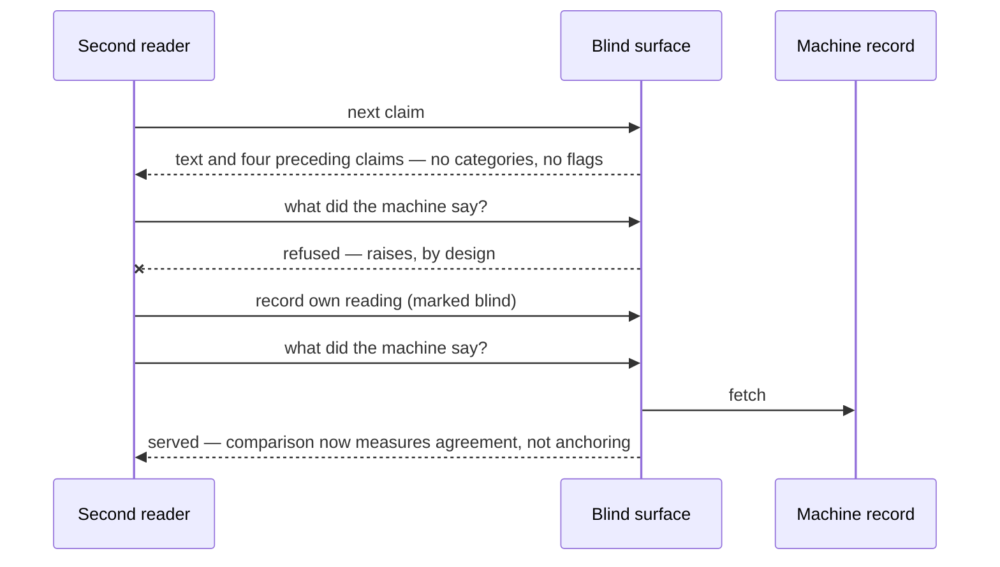
```mermaid
sequenceDiagram
    participant R as Second reader
    participant S as Blind surface
    participant M as Machine record
    R->>S: next claim
    S-->>R: text and four preceding claims — no categories, no flags
    R->>S: what did the machine say?
    S--xR: refused — raises, by design
    R->>S: record own reading (marked blind)
    R->>S: what did the machine say?
    S->>M: fetch
    S-->>R: served — comparison now measures agreement, not anchoring
```

**Caption.** Independence as a property of the procedure rather than of good
intentions. The surface cannot disclose the machine's reading for a claim the
reader has not yet answered — the request does not fail politely; it raises,
because a caller attempting it is a defect in the measurement. Blind readings
are recorded in full and counted in no majority, so a second judge's readings
are never merged into the first judge's tally: two instruments are never
reported as one measurement.

---

## Figure 11.1 — Four designs, two scopes: the discrimination results

*Anchors §11.3 (four designs) and §11.4 (the case-scoped control).*

```mermaid
xychart-beta
    title "Conflict find-rate: real steps vs decoy pairs (n = 28 per arm)"
    x-axis ["open vocab (3.08 SE)", "closed 16 (0.29 SE)", "two-stage (0.54 SE)", "case scope (0.00 SE)"]
    y-axis "conflict found (%)" 0 --> 100
    bar [92.9, 71.4, 60.7, 85.7]
    bar [60.7, 67.9, 53.6, 85.7]
```

**Caption.** The value layer's four designs against the shuffled-pair control
(first series: real steps; second: decoys). The only design that discriminated
(3.08 SE) invented a commitment in three of five open-vocabulary readings;
closing the vocabulary and requiring a conflict first removed the invention
and the discrimination together; and the case-scoped design — the strongest
remaining challenge, §9.5's test of the diagnosis — produced identical rates in
both arms at the *highest* decoy rate of any design. One document, one model,
single runs; the figures inherit those limits (§10.5). The diagnosis the four
share: the question has no ground truth in a found text at any scope a machine
was given.

---

## Figure 11.2 — Premise localisation: Hume and Lewis over the same steps

*Anchors §11.2 (The framework carries a rival meta-ethics).*

```mermaid
flowchart TB
    subgraph FA["Framework A — charges the crossing"]
        A1["ontological to normative: 2<br/>normative to ontological: 2"]
    end
    subgraph FB["Framework B — prices it at zero"]
        B1["ontological to normative: 0<br/>normative to ontological: 0"]
    end
    FA --> S["Same 93 steps,<br/>both rule, both stand"]
    FB --> S
    S --> AG["90 agree"]
    S --> DF["3 differ —<br/>every one at the crossing,<br/>none anywhere else"]

    style DF fill:#cfe2ff,stroke:#0d6efd
```

**Caption.** Two incompatible meta-ethical premises held simultaneously over
one document, neither superseding the other: each ruling names the framework it
was made under, so a rival premise's verdicts are distinguishable from the
first premise's judge changing its mind. The disagreement localises perfectly —
three differing verdicts, all at the one pair whose weights differ — which
establishes that a change of premise propagates exactly where the premise
changed. The caption's limit is the chapter's: localisation is a property of a
deterministic weight lookup, and says nothing about which premise reads the
document better; nothing in the system ranks them.

---

## Figure 12.1 — The maturity criterion: three verdicts

*Anchors §12.1 (The criterion this framework is held to).*

```mermaid
flowchart TB
    C["A mature theory should ascend into abstraction<br/>and descend into practice<br/>without becoming a different theory"] --> H["HOLDS<br/>identity, structure,<br/>transition governance:<br/>the same theory at<br/>every altitude"]
    C --> R["RELOCATED, HONESTLY<br/>the boundary of contextual<br/>judgment moved — from the<br/>step to the closure of the<br/>episode, on argument<br/>and then on test"]
    C --> D["DEMANDS WHAT IT<br/>CANNOT SUPPLY<br/>a vocabulary of what people<br/>protect: substituting one list<br/>for another changed 23 of 28<br/>readings to 11, two keys shared"]

    style H fill:#d1e7dd,stroke:#198754
    style R fill:#fff3cd,stroke:#ffc107
    style D fill:#f8d7da,stroke:#dc3545
```

**Caption.** The record's three answers when the maturity criterion is tested
rather than agreed with. Where the framework holds, the same theory operates at
every level of abstraction; where it relocated, the move was argued before it
was tested (§9.4–9.5); and at the bottom of its descent it requires a
commitment about people — *which* values — that it has no way to license
(§11.6). The figure is the dissertation's self-assessment in one image, and the
third panel is why the value layer's retirement is a conclusion rather than a
setback.

---

## Figure A.1 — The lexicon as a cluster architecture

*Anchors Appendix A (A Lexicon of Contextual Judgment).*

```mermaid
mindmap
  root((The lexicon))
    The record
      Assertion · Standing · Superseded
      Derived · Evidence · Flag
    Identity
      Cognitive Passport · Entity Noise
      Recognition · Role · Referent alias
    Kinds of claim
      the five categories
      Agreement · Blind reading
    Steps between claims
      Promotion · Verdict · Case · Closure
      Is/ought crossing · Contested · Drift
    Values
      Observed Value Priority · Value probe
      Order stability · Shuffled pair
    Actors and authority
      Sentinel Principle · TEI inversion
      Delegation · API token
    Measurement
      Baseline · Inter-judge agreement
      Measurement conditions
```

**Caption.** The appendix's organising structure: terms grouped into clusters
that are mutually exclusive and jointly exhaustive of the system described,
with representative entries shown per cluster. Two properties of the lexicon
matter more than its contents and belong in the figure's reading: the majority
of entries are *generated from the implementation's own data* rather than
authored, so the vocabulary cannot drift from the system it names; and where
one word carries more than one meaning, the collision is declared on both
entries rather than tidied away.

---

## Figure B.1 — The decision record, mapped to the chapters that rest on it

*Anchors Appendix B (The Decision Record).*

```mermaid
flowchart LR
    subgraph DEC["Decisions, by theme"]
        d1["1 · axes<br/>2 · domains ordered<br/>3 · anti-discrimination is policy"]
        d4["4 · framework is data"]
        d5["5 · referent, not entity<br/>21 · a role is an assertion"]
        d6["6 · relationship subsumes transition<br/>7 · flags are assertions<br/>8 · one record type"]
        d9["9 · ingest is deterministic<br/>11 · lock guards predication<br/>13 · no prose<br/>19 · resolution names its decider"]
        d14["14 · observed value priority<br/>15 · peer group supplied"]
        d17["17 · a normative category<br/>18 · a ruling names its premises"]
        d20["20 · judgment waits for closure"]
    end
    d1 --> C4["Ch. 4 — the Matrix"]
    d5 --> C4
    d4 --> C11["Ch. 11 — results"]
    d4 --> C12["Ch. 12 — implications"]
    d6 --> C6["Ch. 6 — the principle"]
    d9 --> C7["Ch. 7 — operation"]
    d9 --> C9["Ch. 9 — contextual judgment"]
    d14 --> C7
    d14 -.-> C12
    d17 --> C11
    d20 --> C9
    d20 --> C11
```

**Caption.** The dissertation's dependency on the reference implementation's
decision register, drawn coarse deliberately: each edge means *a claim in this
chapter would need requalifying if the decision were reversed*. The register,
not this figure, is the authority on attribution — each entry states its own
source, four record the author as theirs, and the appendix's note on the
register's earlier sole-attribution reading is part of the method chapter's
honesty, not a footnote to it.

---

## Figure C.1 — The comparability gate

*Anchors Appendix C (Measurement Conditions).*

```mermaid
flowchart TB
    M1["Measurement A<br/><i>+ stored conditions</i>"] --> G{"Conditions<br/>identical?"}
    M2["Measurement B<br/><i>+ stored conditions</i>"] --> G
    COND["sample · batch size · context window ·<br/>confidence floor · design · persisted ·<br/>categories in force · code revision"] -.-> G
    G -->|"yes"| OK["Comparable:<br/>the difference is a difference"]
    G -->|"no"| NO["Refused — and the diverged<br/>condition is NAMED"]
    ONCE["Criterion measured once"] --> UN["Reported as unmeasured,<br/>never dropped"]

    style NO fill:#fff3cd,stroke:#ffc107
    style OK fill:#d1e7dd,stroke:#198754
```

**Caption.** The discipline every Chapter 11 figure passed through. A number
stored without its conditions cannot distinguish a changed result from a
changed instrument, so each measurement carries eight conditions, and the
comparison routine refuses two figures whose conditions differ — naming the
condition rather than silently declining. The lower path states the
completeness rule: a criterion measured once but not twice is reported as
unmeasured, because a measurement that was not repeated is not a measurement
that agreed.

---

## Figure D.1 — Case inflection against positional rigidity: SVOMPT

*Anchors Appendix D (Case Inflection vs. Positional Rigidity).*

```mermaid
flowchart TB
    subgraph SK["Slovak — endings carry the roles"]
        K1["'Peter vidí psa' =<br/>'Psa vidí Peter'<br/><i>order free; the ending -a<br/>marks the target of the action</i>"]
    end
    subgraph EN["English — position carries the roles"]
        E1["S — who?"] --> E2["V — doing what?"] --> E3["O — to whom or what?"] --> E4["M — how?"] --> E5["P — where?"] --> E6["T — when?"]
    end
    SK -->|"transfer"| R1["Rule 1: time goes last —<br/>fronted only for emphasis,<br/>and then with a comma"]
    SK -->|"transfer"| R2["Rule 2: no hiding the actor —<br/>'Idem do obchodu' hides I<br/>in the verb ending; English cannot"]
    R1 --> EN
    R2 --> EN
```

**Caption.** The structural mismatch beneath Chapter 2, in one example: Slovak
meaning survives word-order permutation because case endings mark the roles,
while English meaning *is* the word order. The two transfer rules are the ones
the appendix marks critical — temporal parameters anchor at the terminal
boundary, and the actor may never be hidden, because an English sentence
without a fronted subject cannot exist. Both reappear in the architecture:
terminal anchoring in the scaffold of Fig. 2.1, and the unhideable actor as
the ancestor of the requirement that every assertion name its asserter.

---

## Figure D.2 — The three mental switches

*Anchors Appendix D (Three Mental Switches).*

```mermaid
flowchart LR
    I["Intent, formed in a<br/>case-based, historically<br/>cautious frame"] --> F1["1 · Positive programming<br/><i>'Nechceš kávu?' — a polite<br/>offer asked in the negative</i>"]
    I --> F2["2 · Language egocentrism<br/><i>who owns the action?</i>"]
    I --> F3["3 · The small-talk filter<br/><i>politeness as social lubricant</i>"]
    F1 --> X["Read through a<br/>position-based frame:<br/>an offer arrives as a refusal"]
    F2 --> X
    F3 --> X
    X --> A["The architectural lesson:<br/>surface polarity cannot be<br/>trusted across frames —<br/>read it, mark where it fails,<br/>never guess the intent"]

    style X fill:#f8d7da,stroke:#dc3545
    style A fill:#d1e7dd,stroke:#198754
```

**Caption.** The cultural half of the transfer problem: three filters through
which well-formed intent is systematically misread across the language
boundary, with the negative-question offer as the canonical case. This is the
phenomenological origin of the polarity layer in Chapter 4 — a surface
negation can carry the very intent it appears to deny — and of its design
consequence: the system reads surface polarity only, deterministically, and
its useful output is not the reading but the marked constructions where the
reading cannot be trusted.
